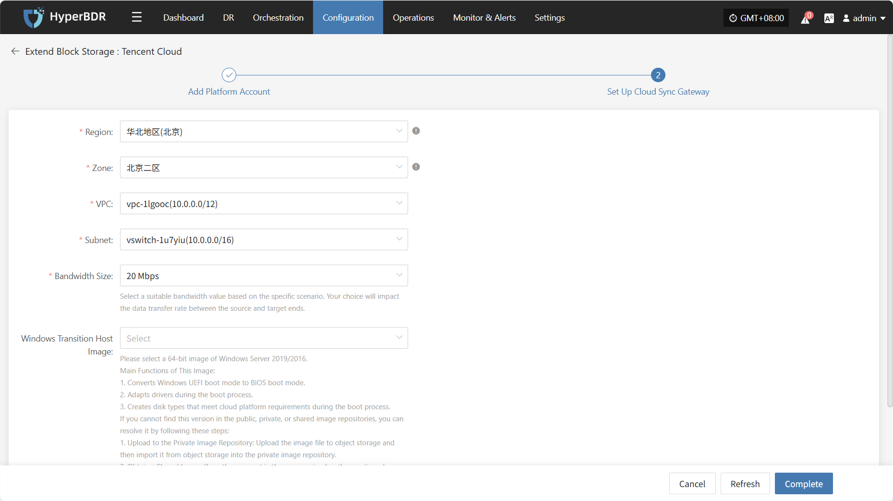
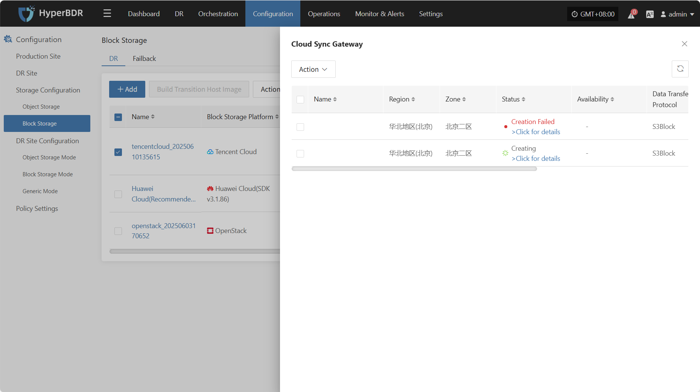
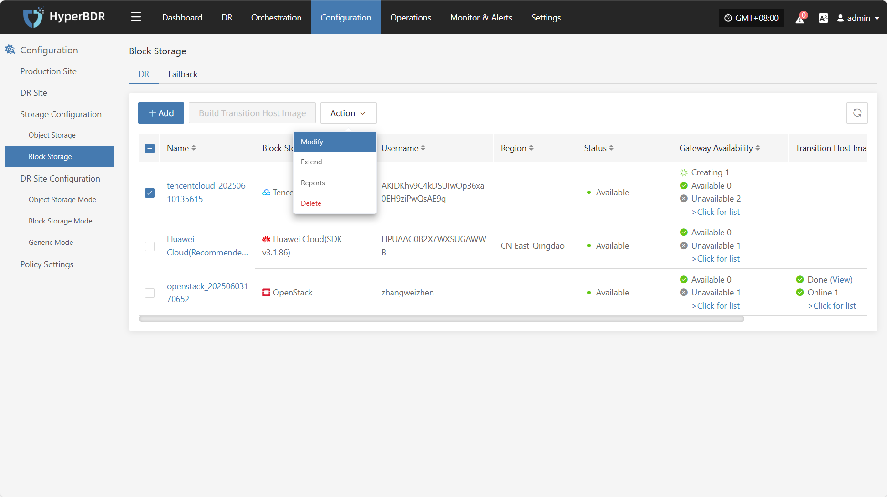
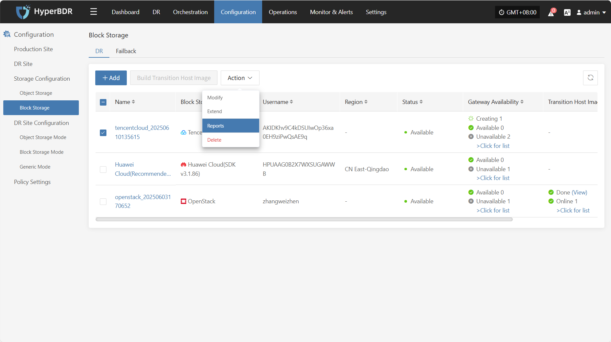
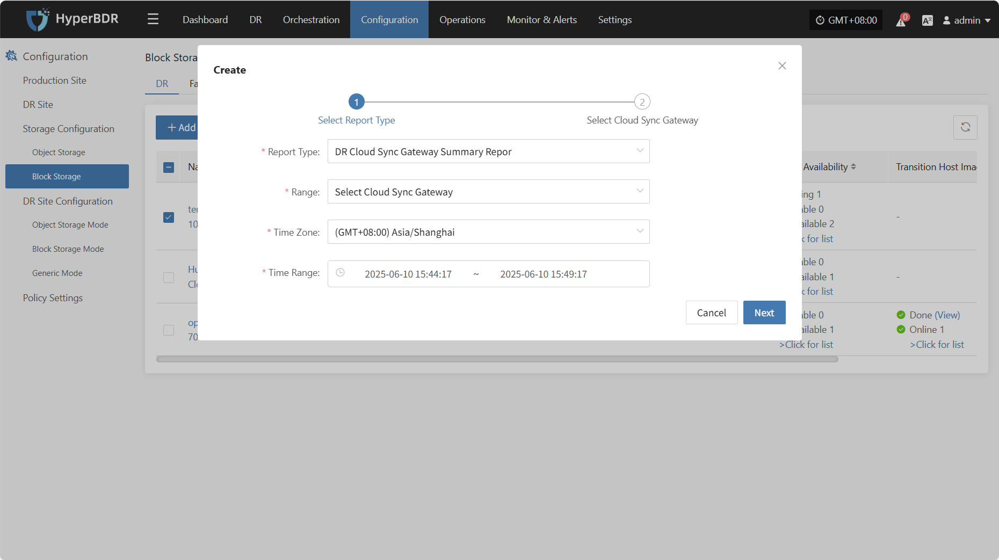
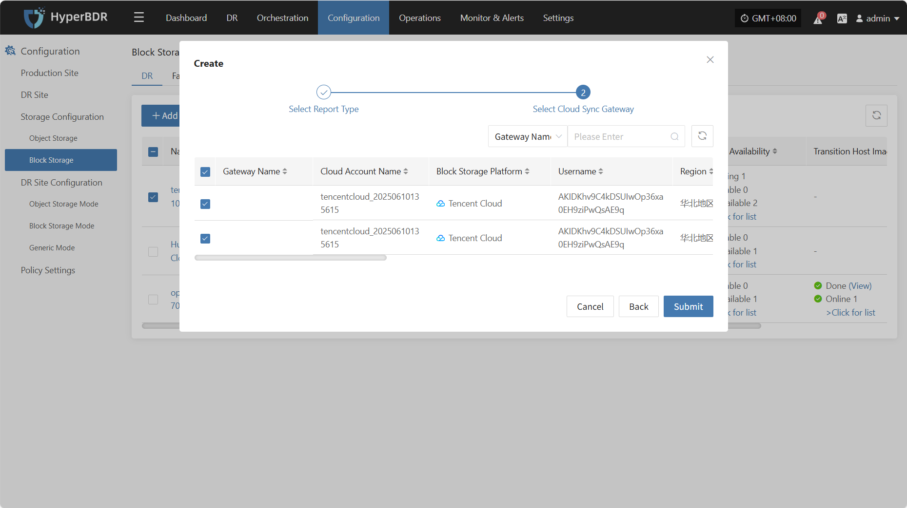
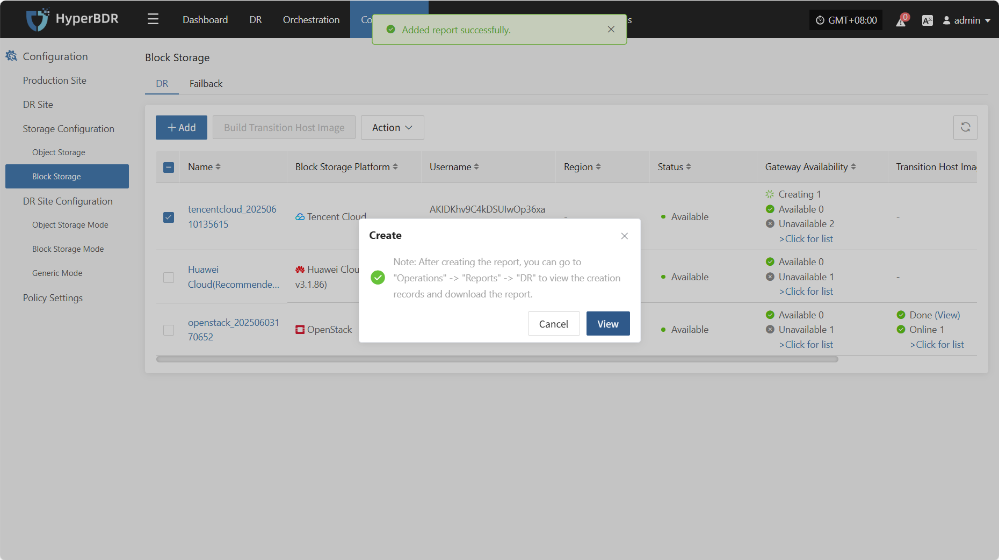
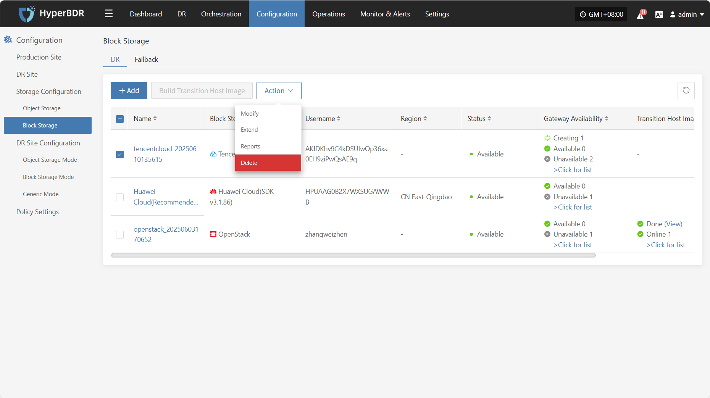
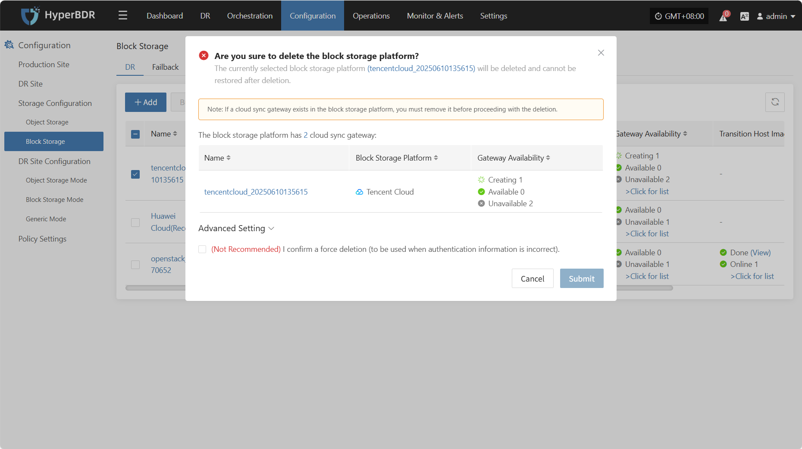

# **Tencent Cloud**

## **Add Block Storage**

From the top navigation bar, select **"Configuration" → "Storage Configuration" → "Block Storage"** to enter the block storage page. Click the "Add" button in the upper right corner to add a new block storage configuration.

### **Add Platform Account**

Select "Tencent Cloud" from the block storage platform dropdown list. Fill in the following authentication information according to your actual environment:

* **Add Platform Account Description**

| **Configuration Item**  | **Example Value**                          | **Description**                                                                                                                                                                                                                                      |
|-------------------------|--------------------------------------------|-------------------------------------------------------------------------------------------------------------------------------------------------------------------------------------------------------------------------------------------------------|
| Block Storage Platform  | Tencent Cloud                              | Select **Tencent Cloud** from the dropdown list.                                                                                                                                                                                                    |
| Access Key ID           | HPUAAG0B2•••••••••••••••                   | API access credential with full account permissions. To obtain it: Log in to the management console → Personal Information (top-right corner) → **[Access Management]** → **[API Key Management]**.                                                |
| Access Key Secret       | •••••••••••••••••••••••••••••••            | API access credential with full account permissions. To obtain it: Log in to the management console → Personal Information (top-right corner) → **[Access Management]** → **[API Key Management]**.                                                |
| App ID                  | 125••••••••                                | An essential credential for Tencent Cloud API requests. To find it: Log in to the management console → Personal Information (top-right corner) → **[Account Information]** → **[Basic Information]** → **APP ID**.                                 |
| Driver Injection        | Yes / No                                   | **This setting applies only when starting a host on the same virtualization platform.** Enabling this option allows skipping the driver adaptation process. **(Not Recommended)** Skipping driver injection may lead to boot failures. Use with caution. |

After adding the platform account, click **"Next"** to start **"Set Up Cloud Sync Gateway"**.

### **Set Up Cloud Sync Gateway**

For the Cloud Sync Gateway, configure the region, subnet, etc., to ensure stable and efficient operation in the target environment.

| **Configuration Item**           | **Example Value**                                        | **Description**                                                                                                                                                                                                                                                                       |
|----------------------------------|----------------------------------------------------------|----------------------------------------------------------------------------------------------------------------------------------------------------------------------------------------------------------------------------------------------------------------------------------------|
| Region                           | North China (Beijing)                                   | Select the region where the Cloud Sync Gateway will be deployed.                                                                                                                                                                                                                      |
| Zone                             | Beijing Zone 2                                          | Select the appropriate availability zone within the selected region from the dropdown list.                                                                                                                                                                                           |
| VPC                              | vpc-1lgooc (10.0.0.0/12)                                | Select the Virtual Private Cloud (VPC) where the Cloud Sync Gateway resides. The actual selection depends on your deployment plan.                                                                                                                                                    |
| Subnet                           | vswitch-1u7yiu (10.0.0.0/16)                            | Select the subnet within the chosen availability zone. The specific option should match your existing network setup.                                                                                                                                                                   |
| Bandwidth Size                   | 20 Mbps                                                 | Choose an appropriate bandwidth value based on your scenario. This directly affects the data transmission speed from the source to the destination.                                                                                                                                   |
| Windows Transition Host Image    | Windows Server 2019 Datacenter Edition 64-bit (ZH, Recommended) | **Main Functions of This Image:** 1. Converts Windows UEFI boot mode to BIOS boot mode. 2. Performs driver adaptation during system startup. 3. Creates disk types that meet cloud platform requirements during boot.  **If the required version is not available in the public, private, or shared image repositories, you can:** ① **Upload to Private Image Repository:** Upload the image file to Object Storage, then import it into the Private Image Repository. ② **Use Shared Image:** If another account in the same region has the required version, request them to share it with your account. |

* **Data Transfer Advanced Setting**

| **Field**             | **Options**                   | **Description**                                                                                 |
|-----------------------|------------------------------|------------------------------------------------------------------------------------------------|
| Data Transfer Protocol| S3Block / iSCSI (Not Recommended) | The protocol for data transfer between the source and the sync gateway. S3Block is widely used for WAN and is more suitable for data transfer. iSCSI is for storage networks and suitable for stable network environments. |

After the Cloud Sync Gateway is set up, click **"Complete"**. The system will automatically create the Cloud Sync Gateway and the transition host image.

### **View Details**

During creation, click ">Click for list" to view the detailed list of created Cloud Sync Gateways.

Select the corresponding host and click ">Click for details" to view detailed logs generated during the task creation process, helping you quickly understand the status and troubleshoot issues.

## **Action**

### **Modify**

Click "Modify" to modify the authentication information.

### **Extend**

Click "Extend" to modify and edit the Cloud Sync Gateway.

### **Report**

Click "Report" to export the report information of the corresponding Cloud Sync Gateway.

Select the report type, data range, time zone, and time range, then click Next. You can select the hosts for which you want to export the report.

### **Delete**

