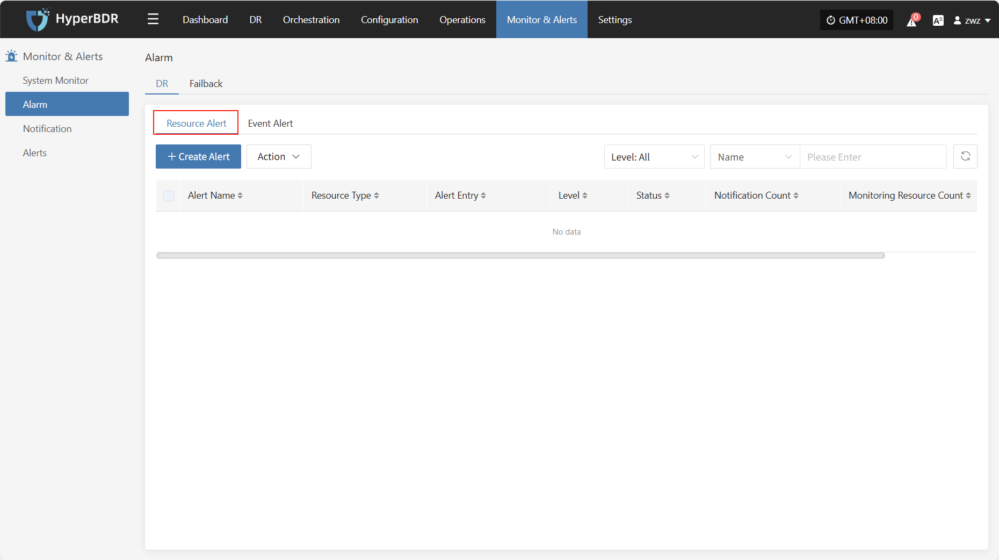
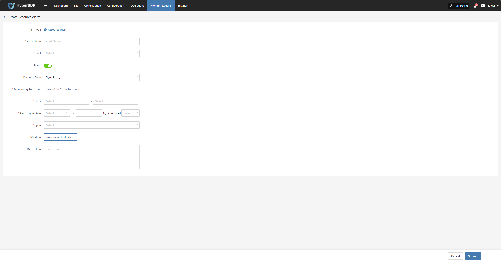
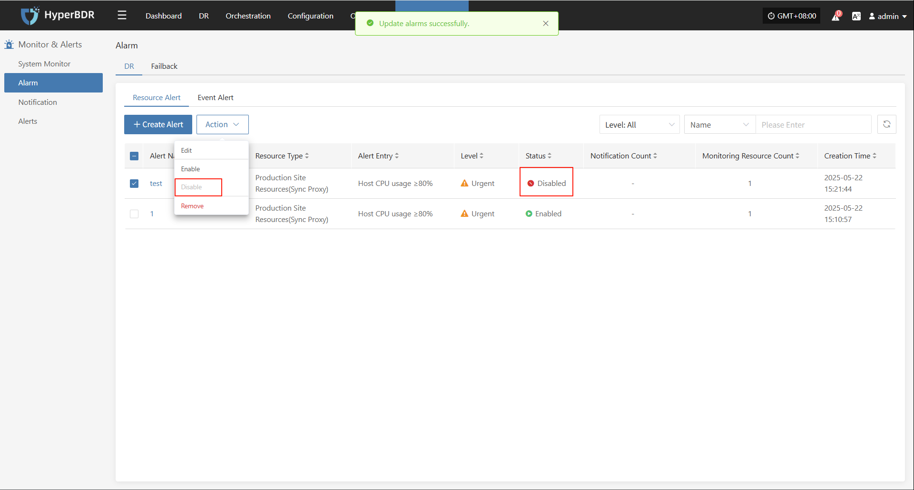
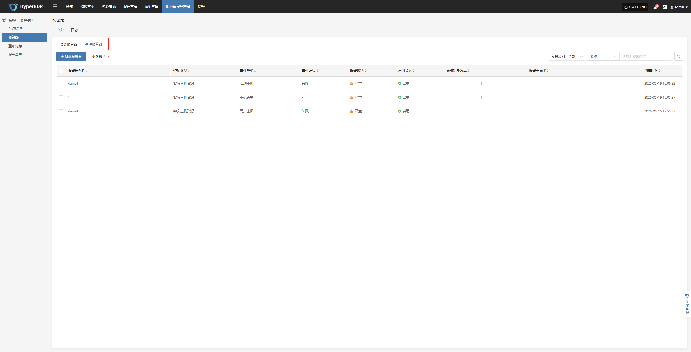
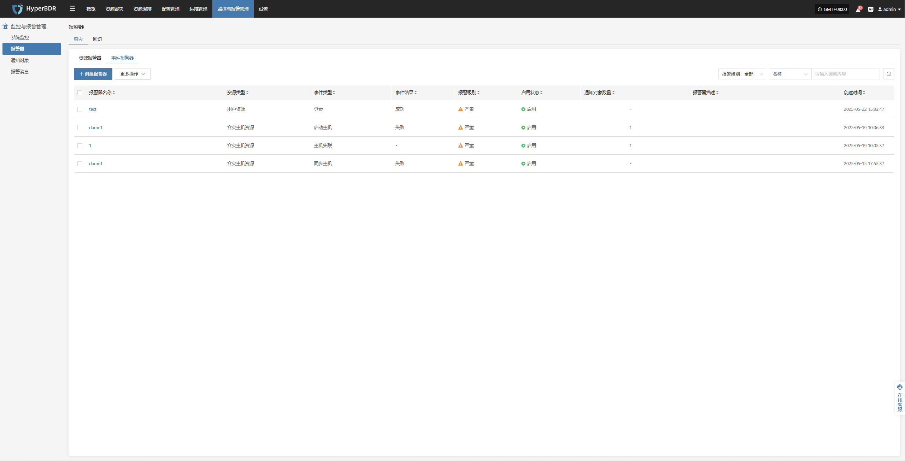
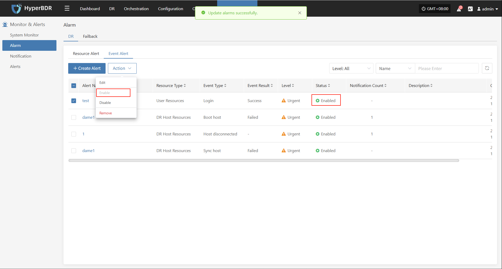
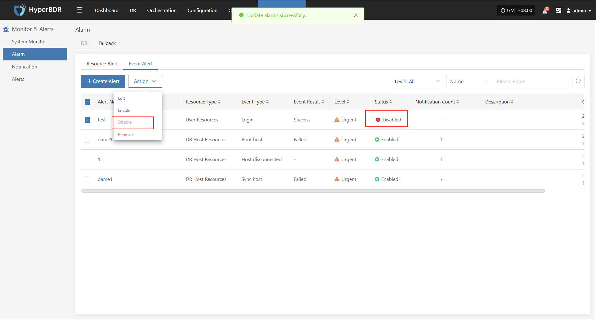
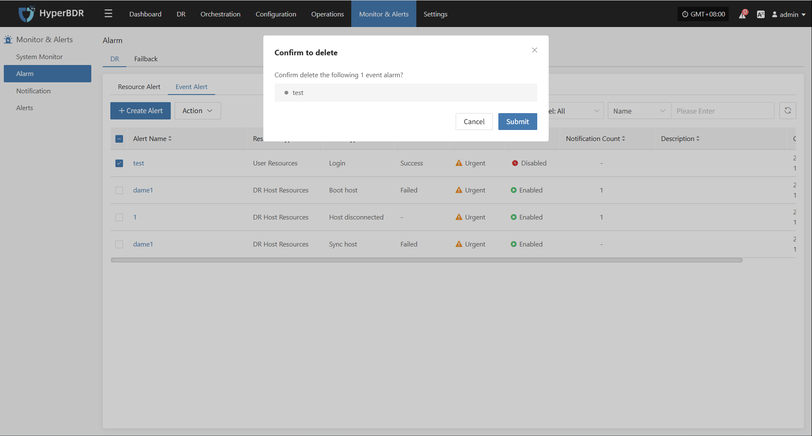

# Alarm

To ensure system security, stability, and visibility of key events, the platform includes a built-in alarm feature. It monitors the status and resource usage of DR hosts in real time and triggers alerts when issues are detected, helping O&M staff quickly identify and resolve problems to reduce business impact.

> For best practices on alarm configuration, see "Monitoring & Alerts → Alarm Best Practice" in the O&M Guide for detailed advice and instructions.

## Resource Alert

Go to:
**Monitor & Alerts → Alarm → Resource Alert → Create Alert**

After navigating to the creation page, configure the required parameters based on your needs, then save to complete the setup of **DR** and **Failback** alerts.

### Create Alert

* Alert Configuration Field Description

| **Field Name**    | **Example**         | **Description**                                                                                  |
|:-----------------:|:------------------:|:-----------------------------------------------------------------------------------------------:|
| Alert Type        | Resource Alert     | Select the alert category or type, used to distinguish different monitoring strategies.          |
| Alert Name        | test               | Custom alert name for identification and management.                                             |
| Level             | Critical           | Set the severity level, e.g., Info, Critical, Emergency.                                        |
| Status            | Enabled            | Enable or disable the alert. When enabled, the system will monitor and alert as configured.      |
| Resource Type     | Sync Proxy         | The type of resource to monitor. Common types: Sync Proxy, Cloud Sync Gateway, Linux Agent, Windows Agent, Object Storage. |
| Monitoring Resources | ubuntu-ova      | Select the resource(s) to monitor. The system will continuously monitor these as configured.     |
| Entry             | CPU                | The specific metric to monitor. Supported: CPU, Disk, RAM, Process.                          |
| Alert Trigger Rule| ≥ 80%, 5 min       | Set the alert trigger condition, e.g., when a metric exceeds a value for a certain time.         |
| Cycle             | 5 min              | How often the system checks the metric status.                                                  |
| Notification      |                    | Who to notify when the alert is triggered (user or group).                                      |
| Description       |                    | Optional. Record the purpose or notes for the alert for easier management.                       |

- Resource Monitoring Types

| **Resource Type** | **Alarm Items**           | **Description**                                       |
|-------------------|---------------------------|-------------------------------------------------------|
| Sync Proxy | CPU, RAM, Disk, Process | Monitors resource usage and process status of source sync proxy |
| Cloud Sync Gateway | CPU, RAM, Disk, Process | Monitors resource usage and process status of cloud sync gateway |
| Linux Agent       | CPU, RAM, Disk, Process | Monitors resource usage and process status of Linux Agent |
| Windows Agent     | CPU, RAM, Disk, Process | Monitors resource usage and process status of Windows Agent |
| Object Storage Resources   | Object Storage Capacity    | Monitors usage of storage capacity                   |

* After the alert is created, the system will automatically trigger it when the event occurs and send notifications to the assigned recipients. Related alert information will also be shown on the "Alert Messages" page for unified management.

### **Action**

#### **Edit**

* Click [Edit] to go to the edit page, where you can update the alert configuration.

#### **Enable**

* Enabled alerts cannot be edited. To change the configuration, please disable the alert first.

#### **Disable**

* Disabled alerts cannot be edited. To change the configuration, please enable the alert first.

#### **Remove**

* Click [Remove] to trigger a confirmation. After confirming, the system will delete the alert.

## Event Alert

Go to:
**Monitor & Alerts → Alarm → Event Alert → Create Alert**

After navigating to the creation page, configure the required parameters based on your needs, then save to complete the setup of **DR** and **Failback** alerts.

### Create Alert

* Alert Configuration Field Description

| **Field Name**    | **Example**    | **Description**                                                                                           |
|:-----------------:|:-------------:|:--------------------------------------------------------------------------------------------------------:|
| Alert Type        | Event Alert   | Set the alert type. Event alerts monitor key actions and abnormal states, and trigger notifications.      |
| Alert Name        | test          | Custom alert name for identification and management.                                                      |
| Level             | Critical      | Severity level, e.g., Info, Critical, Emergency.                                                          |
| Status            | Enabled       | Whether the alert is enabled. When enabled, the system will monitor and alert as configured.              |
| Event Type        | User Resource / Login | The event type to monitor. Supported: User Resource, DR Host Resource, License Resource, Production Site Resources, DR Resource, Monitoring Alarm, Object Storage, Resource Policies. |
| Event Result      | Success       | The event result that triggers the alert. E.g., Success, Failure.                                         |
| Notification      | Notification Recipient | Who to notify when the alert is triggered (person or group).                                             |
| Description       | —             | Briefly describe the alert's function or purpose for easy identification and maintenance.                 |

- Event Type Descriptions

| **Event Type**                | **Alert Conditions (Examples)**                                                                                                                                                                                                                                      | **Description**                                                       |
| ----------------------------- | -------------------------------------------------------------------------------------------------------------------------------------------------------------------------------------------------------------------------------------------------------------------- | --------------------------------------------------------------------- |
| **User Resources**            | Login, Logout, Modify phone number, Change password, Reset password                                                                                                                                                                                                  | Events related to user login activities and account updates.          |
| **DR Host Resources**         | Add DR host configuration, Boot host, Clean host resource, Forced abort of task, Host disconnected, Host recovery timeout,  Sync host, Takeover host, Register host,  Limit/Unlimit host resource, Limit/Unlimit transfer rate, Update DR host configuration | Key events for DR host configuration, task execution, and status.     |
| **License Resources**         | Add license                                                                                                                                                                                                                                                          | Events related to license status and updates.                         |
| **Production Site Resources** | Add/Delete Linux or Windows agent, Add/Delete/Bind/Unbind sync proxy or connection, Refresh sync proxy VMs, Update sync proxy connection                                                                                                                             | Events related to agent deployment and sync proxy configuration.      |
| **DR Site Resources**         | Add/Delete/Update cloud account, Create/Delete/Start create/Delete cloud sync gateway                                                                                                                                                                                | Events related to DR site configuration and cloud sync gateway.       |
| **Monitoring Alarm**          | Create/Delete/Update alarm, Create/Delete/Update notification                                                                                                                                                                                                        | Events related to alarm rules and notification settings.              |
| **Resource Groups**           | Create/Delete resource group, Clean resources, Sync data, Drill/Takeover DR, Start drill/sync/clean/takeover                                                                                                                                                         | Events related to grouped resource management and DR operations.      |
| **Object Storage**            | Add/Delete/Update object storage, Start add/delete object storage                                                                                                                                                                                                    | Events for changes to object storage configuration or access.         |
| **Resource Policies**         | Associate/Disassociate/Create/Delete/Update resource policies                                                                                                                                                                                                        | Events related to lifecycle management of disaster recovery policies. |

* After the alert is created, the system will automatically trigger it when the event occurs and send notifications to the assigned recipients. Related alert information will also be shown on the "Alert Messages" page for unified management.

### **Action**

#### **Edit**

* Click [Edit] to go to the edit page, where you can update the alert configuration.

#### **Enable**

* Enabled alerts cannot be edited. To change the configuration, please disable the alert first.

#### **Disable**

* Disabled alerts cannot be edited. To change the configuration, please enable the alert first.

#### **Remove**

* Click [Remove] to trigger a confirmation. After confirming, the system will delete the alert.

