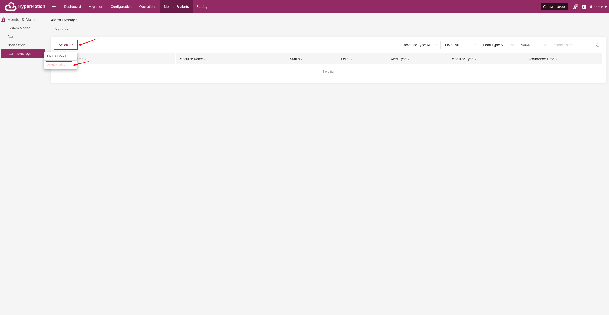

# Alerts

The system monitors the status of various resources and key events based on alert rules you set. When abnormal metrics are detected or preset alert conditions are triggered, the platform will automatically generate alert messages.

> If you assign notification contacts when creating an alert, the system will notify them by email, SMS, or other methods as appropriate.

## Migration

- Alert Message Fields

When the system detects a resource issue or event trigger, it generates an alert message. The main fields are:

Here is your table translated into clear, simple English for a disaster recovery product document:

|     Field Name      | Description                                                                                                                                                                                                                                                                                        |
| :-----------------: | -------------------------------------------------------------------------------------------------------------------------------------------------------------------------------------------------------------------------------------------------------------------------------------------------- |
|   **Alarm Name**    | The type of event that triggers the alarm, used to quickly identify the root cause of the issue.                                                                                                                                                                                                   |
|  **Resource Name**  | The specific resource that triggered the alarm, such as a host name or service name.                                                                                                                                                                                                               |
|     **Status**      | The current handling status of the alarm, for example, "Unprocessed" or "Processed".                                                                                                                                                                                                               |
| **Severity Level**  | The severity of the alarm event, commonly classified as "Info", "Critical", or "Emergency".                                                                                                                                                                                                        |
|   **Alarm Type**    | The specific category of the alarm, such as "Event Alarm" or "Resource Alarm".                                                                                                                                                                                                                     |
|  **Resource Type**  | The types of resources involved, including: · Object Storage · Disaster Recovery Policy User Resources · Disaster Recovery Host Resources · License Resources · Production Platform Resources · Disaster Recovery Platform Resources · Monitoring Alarms · Resource Groups |
| **Occurrence Time** | The time when the system first detected the alarm event, used for tracing the issue and analyzing response time.                                                                                                                                                                                   |

- More Actions

On the alert messages page, you can manage alerts by marking them as "Read" or updating their status for easier tracking and management.

After processing, the status will be updated:

