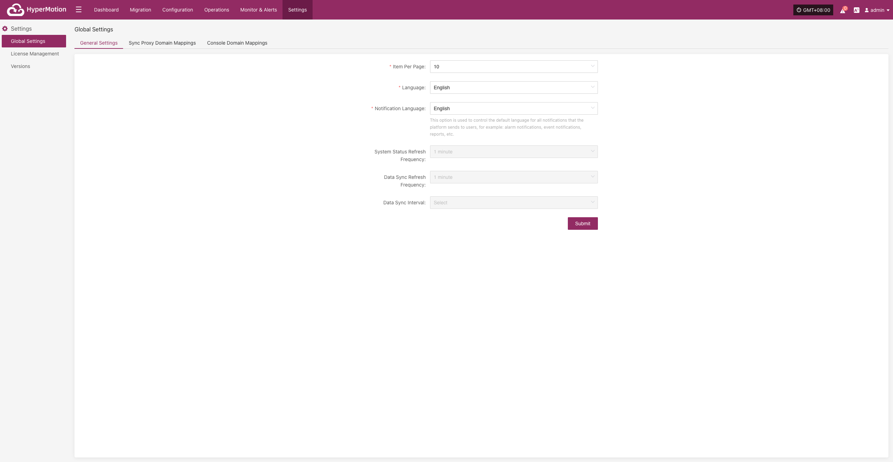
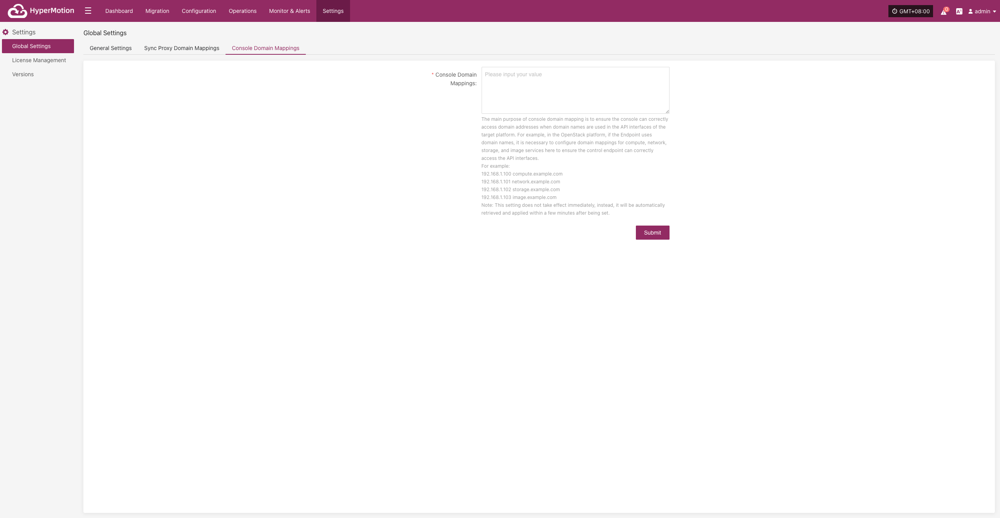

# **Global Settings**

## **General Settings**

You can configure platform settings as needed, including data display items, language, and more.

- Parameter Description

|          **Parameter**          |              **Options**               |                              **Description**                              |
| :-----------------------------: | :------------------------------------: | :-----------------------------------------------------------------------: |
|         Items per page          |      10 / 20 / 30 / 40 / 50 / 60       |   Set the number of items displayed per page in tables. Default is 10.    |
|            Language             | Simplified Chinese / English / Spanish | Default display language for the platform. Only affects the current user. |
|      Notification Language      |      Simplified Chinese / English      |       Language used for system alerts (emails, SMS, Webhook, etc.).       |
| System Status Refresh Frequency |                1 minute                |          Default is 1 minute. Cannot be changed in this version.          |
|   Data Sync Refresh Frequency   |                1 minute                |          Default is 1 minute. Cannot be changed in this version.          |
|       Data Sync Interval        |                  N/A                   |                       Not configurable by default.                        |



## **Sync Proxy Domain Mappings**

In global settings, click "Sync Proxy Domain Mapping" to add domain and IP mappings for the source production platform. The format is the same as the `/etc/hosts` file in Linux.

- Parameter Description

This mapping is mainly used when the source needs to connect to vCenter, ESXi, or cloud platform APIs using domain names but DNS is not configured. Without this, the sync proxy cannot synchronize data properly. For example, in a VMware environment with multiple ESXi hosts, you need to configure the IP and domain mapping for each host here.
Example:

```plaintext
192.168.1.10 esxi1.example.com
192.168.1.11 esxi2.example.com
192.168.1.12 esxi3.example.com
```

> Note: This setting does not take effect immediately. It will be applied automatically within a few minutes after configuration.

## **Console Domain Mappings**

In global settings, click "Console Domain Mapping" to add domain and IP mappings for the source production platform. The format is the same as the `/etc/hosts` file in Linux.

- Parameter Description

The main purpose of console domain mapping is to ensure the console can access target platform APIs when domain names are used. For example, on OpenStack, if endpoints use domain names, you need to configure domain mappings for compute, network, storage, and image services here so the console can access the APIs correctly.
Example:

```plaintext
192.168.1.100 compute.example.com
192.168.1.101 network.example.com
192.168.1.102 storage.example.com
192.168.1.103 image.example.com
```

> Note: This setting does not take effect immediately. It will be applied automatically within a few minutes after configuration.


