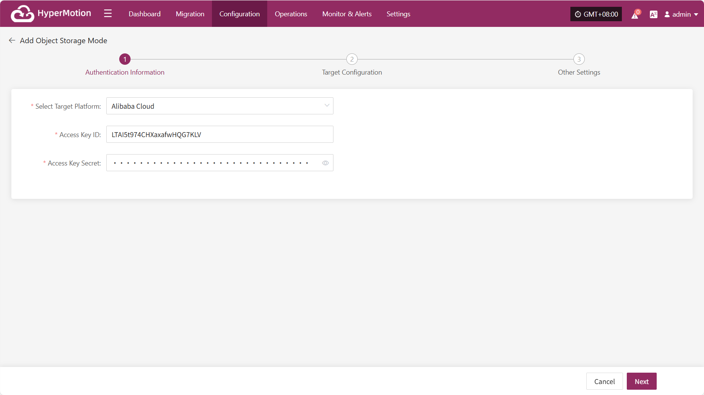
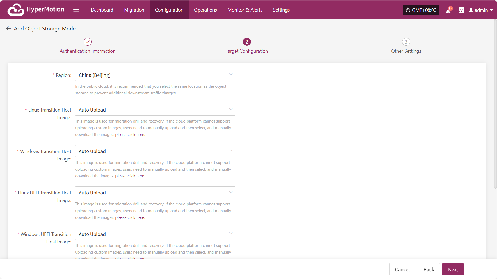

# Alibaba Cloud

## **Add Object Storage**

From the top navigation bar, select **"Configuration" → "Target Site Configuration" → "Object Storage"** to enter the object storage page. Click the "Add" button to add a new object storage configuration.

### **Authentication Information**

In the recovery platform dropdown, select "Tencent Cloud". Fill in the following authentication information based on your actual situation:

* **Authentication Information Description**

| **Configuration Item**             | **Example Value**                        | **Description**                                                                                                                                           |
|------------------------|----------------------------------|----------------------------------------------------------------------------------------------------------------------------------------------------|
| Select Recovery Platform | Alibaba Cloud                    | Find and select Alibaba Cloud from the dropdown list.                                                                                                               |
| Access Key ID          | HPUAAG0B2•••••••••••••••         | The key for accessing Alibaba Cloud API with full account permissions. Log in to the management console - Personal Information (top-right corner) - Access [KeyManagement]. |
| Access Key Secret      | •••••••••••••••••••••••••••••••• | The key for accessing Alibaba Cloud API with full account permissions. Log in to the management console - Personal Information (top-right corner) - Access [KeyManagement]. |

After filling in the authentication information, click **"Next"** to proceed to **"Target Configuration"**.

### **Target Configuration**

* **Target Configuration Description**

| **Configuration Item**                         | **Example Value**                      | **Description**                                                                                                                                                                                                                                                                                                                                                                                     |
|----------------------------------|--------------------------------|--------------------------------------------------------------------------------------------------------------------------------------------------------------------------------------------------------------------------------------------------------------------------------------------------------------------------------------------------------------------------------------------|
| Region                           | North China 2 (Beijing)                   | In the public cloud, it is recommended to select the same location as the object storage to avoid extra downstream traffic charges.                                                                                                                                                                                                                                           |
| Linux Transition Host Image      | Auto Upload                    | This image is used for disaster recovery drill and recovery. If the cloud platform cannot support uploading custom images, users need to manually upload and select images and download images manually.                                                                                                                                                                                    |
| Windows Transition Host Image    | Auto Upload                    | This image is used for disaster recovery drill and recovery. If the cloud platform cannot support uploading custom images, users need to manually upload and select images and download images manually.                                                                                                                                                                                    |
| Linux UEFI Transition Host Image | Auto Upload                    | This image is used for disaster recovery drill and recovery. If the cloud platform cannot support uploading custom images, users need to manually upload and select images and download images manually.                                                                                                                                                                                    |
| Windows UEFI Transition Host Image | Auto Upload                  | This image is used for disaster recovery drill and recovery. If the cloud platform cannot support uploading custom images, users need to manually upload and select images and download images manually.                                                                                                                                                                                    |
| Console to Transition Host Network | Private Network / Public Network | This option is mainly used for: 1. Creating the transition host image during the initialization process. The network used for communication between the console and the transition host during image creation. 2. Configuring the communication network between the migration console and the transition host during the startup process.  **Configuration Suggestion:** ① In a private cloud, if the migration console can directly communicate with the VM's own address, select the private network for communication. ② In a public cloud, if there is no dedicated line, select the public network for communication. |
| Name                             | Alibaba Cloud China (Beijing)  | If you do not enter an ID, it will be generated automatically.                                                                                                                                                                                                                                                                                                                                 |

After completing the target configuration, click **"Next"** to proceed to **"Other Settings"**.

<!-- @include: ./huawei.md#snippet -->