# **容灾计算器使用手册**

## **功能概述**

容灾计算器是为用户提供在线估算容灾服务成本的工具，支持多种服务场景、云平台与配置方式的组合。通过填写核心参数信息，系统将自动生成推荐资源规格与费用明细，便于用户在采购授权前进行合理规划。

> **温馨提示：** 以下配置信息将用于辅助评估 HyperBDR 容灾方案的整体建设规模及预估成本。请根据实际业务需求认真填写，以便生成更具参考价值的方案建议。如有任何疑问，欢迎随时联系客户经理获取支持。

## **访问方式**

方式一：通过官网入口访问

访问 OnePro 官方文档网站：<https://docs.oneprocloud.com/zh/>

在顶部导航栏点击“**容灾计算器**”即可进入计算页面。

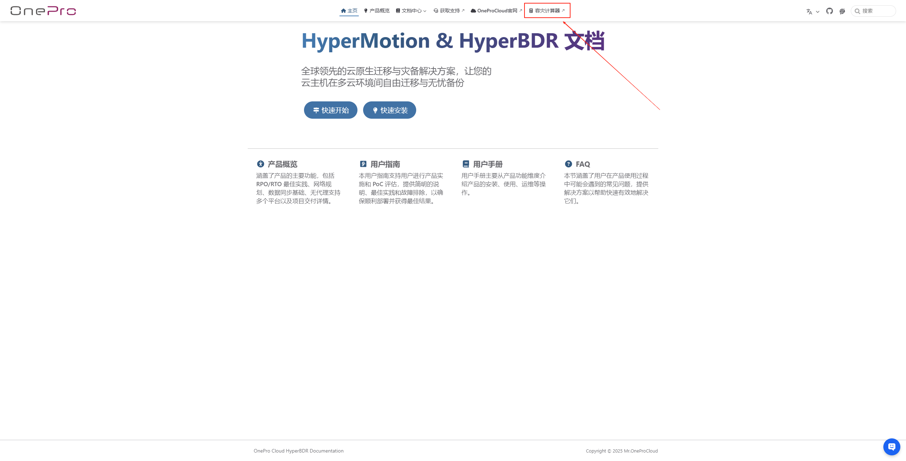

方式二：点击下方直达链接

[点击此处跳转至容灾计算器页面](https://calculator.oneprocloud.com/home)

## **基础服务配置**

在使用容灾计算器前，用户需在页面上选择并提供如下关键信息，包括业务场景、目标平台、账号类型、部署区域、资源类型等内容。&#x20;

### **服务场景**

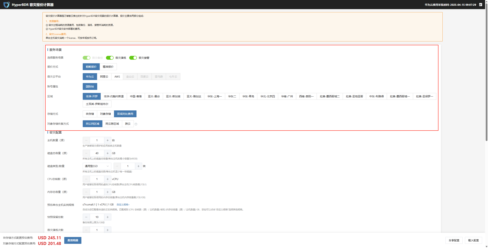

* 配置说明

| **配置项**  | **示例值**            | **说明**                                                                                    |
| -------- | ------------------ | ----------------------------------------------------------------------------------------- |
| 选择服务场景   | 容灾备份、容灾演练、容灾接管     | 可多选，“容灾备份”为必选项                                                                            |
| 报价方式     | 粗略报价 / 精确报价        | 精确报价时将激活更详细配置项，用于生成准确资源规格与成本数据                                                            |
| 容灾云平台    | 华为云                | 云平台不同将影响推荐实例、计费方式等                                                                        |
| 账号属性     | 国际站                | 国内站/国际站价格结构略有不同                                                                           |
| 区域       | 非洲-开罗              | 区域不同将影响资源价格                                                                               |
| 存储方式     | 块存储、对象存储           | 支持双项对比费用，结果展示时将分别列出                                                                       |
| 对象存储恢复方式 | 同云同区域 / 同云跨区域 / 跨云 | 该选项仅在选择对象存储时出现，**同云同区域**网络传输通常免费或费用最低，**同云跨区域**可能会产生较高的跨区域流量费，**跨云**则需通过公网传输可能会产生较高的出网流量费 |

不同存储类型（块存储 / 对象存储）的**适用场景**和**计费差异**可分别点击查看：[了解适用场景](../../product-overview/product-training/scenarios.md#阶段2-备份与恢复-对象存储服务) | [查看计费差异](../../product-overview/presales/hyperbdr-rpo-rto-planning-best-practices.md#hyperbdr-rpo和rto)。

### **容灾配置（服务场景选择报价方式不同此处配置略有不同）**

#### **粗略报价**

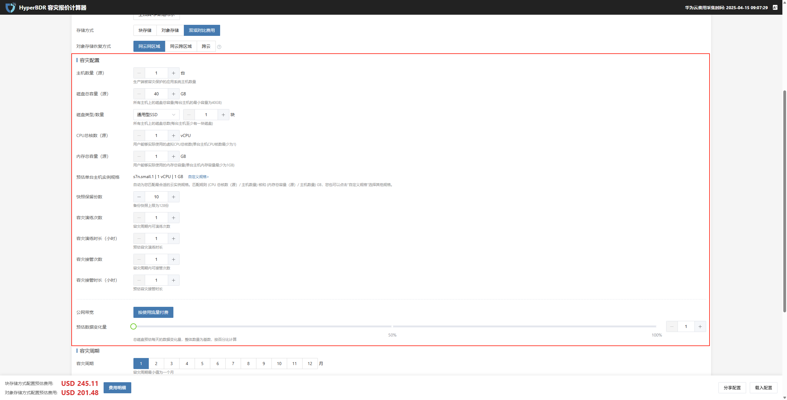

* 配置说明

| **配置项**    | **示例值**       | **说明**                               |
| ---------- | ------------- | ------------------------------------ |
| 主机数量（源）    | 1             | 生产端被容灾保护的主机数量                        |
| 磁盘总容量（源）   | 40            | 所有主机磁盘总容量（单位 GB）                     |
| 磁盘类型/数量    | 通用型 SSD / 1   | 各主机至少 1 块磁盘，磁盘类型依据云平台选项              |
| CPU 总核数（源） | 8             | 所有主机可用的总 vCPU 数量                     |
| 内存总容量（源）   | 16            | 所有主机总内存（单位 GB）                       |
| 推荐实例规格     | s7n.2xlarge.2 | 系统自动根据 CPU 和内存计算推荐云规格，如需调整可点击“自定义规格” |
| 快照保留份数     | 10            | 快照最多支持 128 份                         |
| 容灾演练次数     | 1             | 容灾周期内支持的最大演练次数                       |
| 容灾演练时长（小时） | 1             | 单次容灾演练预估时长                           |
| 容灾接管次数     | 1             | 容灾周期内的最大接管次数                         |
| 容灾接管时长（小时） | 1             | 单次容灾接管预计持续时间                         |
| 公网带宽       | 按使用流量付费       | 默认使用按量计费方式                           |
| 每日数据变化率（%） | 50            | 用于估算每日新增数据量，建议根据实际业务负载设定             |

#### **精确报价**

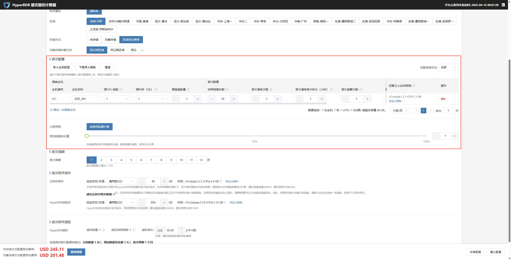

* 可下载导入模板后，按要求填写主机资源信息；

用户可点击页面中的“下载导入模板”，填写主机配置信息后，通过“导入主机配置”功能一次性导入多个主机，提升配置效率。

> 示例字段包括：主机名、磁盘数、CPU、内存、操作系统类型等

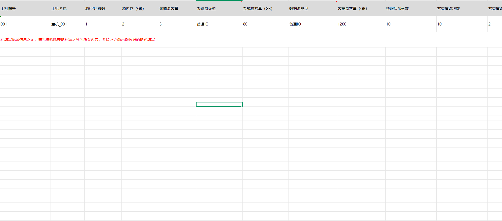

* 上传模板后页面将同步更新主机列表内容；

模板填写并批量导入后，页面源端主机区域将自动新增对应主机信息。后续如需调整，可通过页面操作按钮进行修改或删除。

> 注意：导入模板时，部分字段信息（如 CPU 核心数、内存大小等）可能在云厂商模板中无对应配置，导致无法匹配合适的实例主机，需手动选择相应的实例规则。

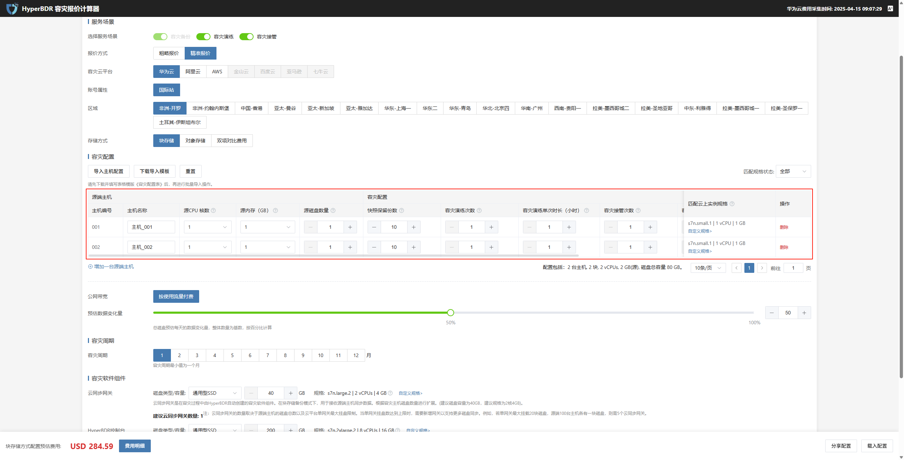

* 支持后续在页面中继续编辑、删除导入项。

### **容灾周期**

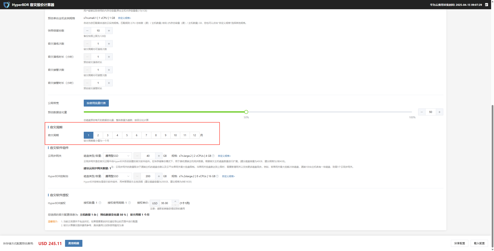

* 配置说明

| 配置项  | 配置示例 | 说明          |
| ---- | ---- | ----------- |
| 容灾周期 | 6    | 容灾周期最小值为一个月 |

### **容灾组件**

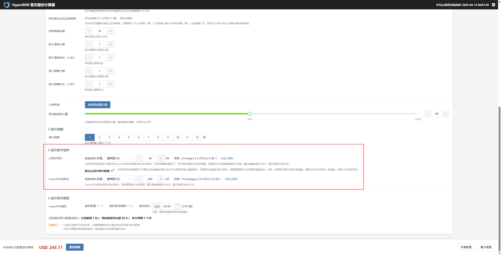

#### **云同步网关**

云同步网关是在容灾过程中由HyperBDR自动创建的容灾软件组件。在块存储备份模式下，用于接收源端主机同步数据。

> 注：云同步网关的数量取决于源端主机的磁盘总数以及云平台单网关最大挂盘限制。当单网关挂盘数达到上限时，需要新增网关以支持更多磁盘同步。例如，若单网关最大挂载20块磁盘，源端100台主机各有一块磁盘，则需5个云同步网关。

| 配置项           | 配置示例       | 规格                             | 说明                                               |
| ------------- | ---------- | ------------------------------ | ------------------------------------------------ |
| **磁盘类型 / 容量** | 通用型 SSD 40 | s7n.large.2 \| 2 vCPUs \| 4 GB | 根据容灾主机磁盘数量自动扩展。建议单块磁盘容量不少于 40GB，推荐实例规格为 2 核 4GB。 |
| **建议云同步网关数量** | 1          | --                             | 系统将根据容灾主机数量自动计算建议的同步网关数量，用户无需手动配置。               |

#### **HyperBDR控制台**

HyperBDR控制台是容灾软件组件，用来管理容灾主控流程（建议磁盘容量为200GB，建议规格为8核16GB）

> 在对象存储模式下，因 Redis 需存储元数据，8核16GB配置最多支持保护生产环境主机总容量约10TB的数据（128快照，增量小于5%）。当数据量超过10TB且不超过30TB时，建议将内存扩容至32GB；超过30TB且不超过50TB时，建议扩容至64GB；若数据量更大，建议单独部署 Redis 节点以满足内存需求。

| 配置项           | 配置示例        | 规格                                | 说明                                               |
| ------------- | ----------- | --------------------------------- | ------------------------------------------------ |
| **磁盘类型 / 容量** | 通用型 SSD 200 | s7n.2xlarge.2 \| 8 vCPUs \| 16 GB | 根据容灾主机磁盘数量自动扩展。建议单块磁盘容量不少于 40GB，推荐实例规格为 2 核 4GB。 |

### **容灾软件授权**

在选择服务场景、配置参数和容灾组件后，系统将动态计算资源数量及建议配置，用于预估授权需求。

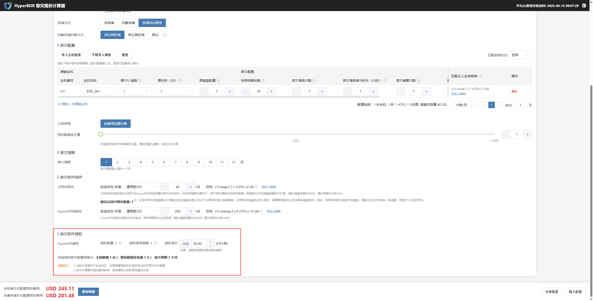

### **费用明细**

在完成所有配置选项后，系统会自动计算所需资源与费用，点&#x51FB;**“费用明细”**&#x53EF;展开查看详细报价构成。

点击顶部菜单栏，可分别查看块存储与对象存储的详细费用清单，便于对比不同存储类型的成本结构。

#### **块存储模式**

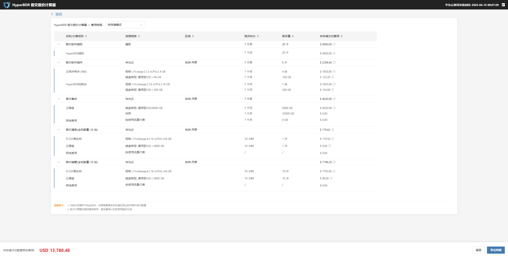

* 详细清单

| 名称/计费项目         | 资源规格 | 区域    | 购买时长 | 购买量 | 块存储方式费用 | 说明                                       |
| --------------- | ---- | ----- | ---- | --- | ------- | ---------------------------------------- |
| 容灾软件组件          | 华为云  | 非洲-开罗 | 1 个月 | 2 个 | $205.63 | 云同步网关总价 + HyperBDR控制台总价，云同步网关数量以平台预估计算为例 |
| 容灾软件授权          | 授权   | --    | 1 个月 | 1 个 | $35.00  | 授权数量 × 授权使用周期 × 授权每个每月单价                 |
| 容灾演练(主机数量: 1 台) | 华为云  | 非洲-开罗 | --   | --  | $0.04   | 云硬盘总价 + 网络费用                             |
| 容灾接管(主机数量: 1 台) | 华为云  | 非洲-开罗 | --   | --  | $0.04   | ECS计算实例总价 + 云硬盘总费用 + 网络费用                |
| 容灾备份            | 华为云  | 非洲-开罗 | 1 个月 | --  | $4.40   | ECS计算实例总价 + 云硬盘总费用 + 网络费用                |

#### **对象存储模式**

* 详细清单

| 名称/计费项目         | 资源规格 | 区域    | 购买时长 | 购买量 | 块存储方式费用 | 说明                         |
| --------------- | ---- | ----- | ---- | --- | ------- | -------------------------- |
| 容灾软件组件          | 华为云  | 非洲-开罗 | 1 个月 | 2 个 | $205.63 | HyperBDR控制台总价，对象存储不需要云同步网关 |
| 容灾软件授权          | 授权   | --    | 1 个月 | 1 个 | $35.00  | 授权数量 × 授权使用周期 × 授权每个每月单价   |
| 容灾演练(主机数量: 1 台) | 华为云  | 非洲-开罗 | --   | --  | $0.04   | 云硬盘总价 + 网络费用               |
| 容灾接管(主机数量: 1 台) | 华为云  | 非洲-开罗 | --   | --  | $0.04   | ECS计算实例总价 + 云硬盘总费用 + 网络费用  |
| 容灾备份            | 华为云  | 非洲-开罗 | 1 个月 | --  | $4.40   | ECS计算实例总价 + 云硬盘总费用 + 网络费用  |

点击“导出明细”按钮后，系统将生成并导出完整的费用明细，便于用户查看和保存。

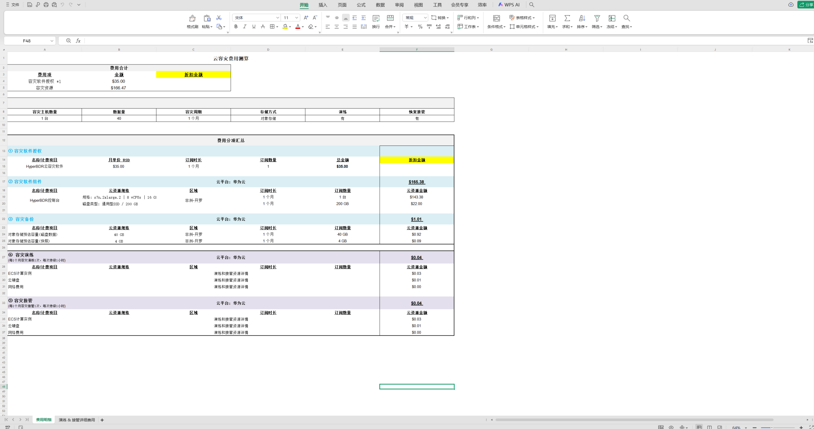

#### **费用差异对比情况**

以20台16核64GB配置的源端主机，配备80块磁盘、6TB数据，演练时长预计约10小时为例，块存储与对象存储资费情况对比如下：

| **项目**     | **块存储费用情况**        | **对象存储费用情况**       | **分析说明**                         |
| ---------- | ------------------ | ------------------ | -------------------------------- |
| **容灾软件授权** | $4900.00 （20个，7个月） | $4900.00 （20个，7个月） | 授权费用相同，与存储类型无关。                  |
| **容灾软件组件** | $2284.66 （5个，7个月）  | $1157.66 （1个，7个月）  | 对象存储组件费用明显低于块存储，组件数量少，成本更低。      |
| **容灾备份**   | $4,620.00          | $5,336.11          | 由于对象存储的存储和访问机制不同，对象存储备份费用稍高于块存储。 |
| **容灾演练**   | $179.62 （20台主机）    | $179.62 （20台主机）    | 演练费用相同，存储方式对演练费用影响较小。            |
| **容灾接管**   | $1,796.20          | $1,796.20          | 接管费用相同，存储类型对该项无明显影响。             |

## **常见问题（FAQ）**

**选择多个服务场景时费用如何计算？**

> 系统将整合各场景所需配置项与资源规格，最终汇总成综合授权需求。

**为什么我上传模板后没有主机出现？**

> 请检查模板格式是否正确，或字段名是否被误改。

**粗略报价与精确报价有何区别？**

> 粗略报价仅基于主机数量与容量给出大致估值，精确报价会计算网络、演练、接管等资源项，结果更精准。

## **注意事项**

* 建议在业务低峰期操作容灾演练与接管；

* 若存在大批量主机或特殊规格需求，请优先使用“导入模板”方式进行配置；

* 容灾演练与接管次数会影响 License 授权成本，请合理评估使用频率。

> 本文档适用于 OnePro HyperBDR SaaS 产品下的“容灾计算器”模块，所有示例与配置项说明均基于当前版本界面（2025年6月），后续功能可能随版本更新略有调整。

