# **华为云(推荐使用，SDKv3.1.86)**

## **添加块存储**

通过顶部导航栏依次选择 **“配置管理” → “存储配置” → “块存储”** 进入块存储页面，点击右上角 “添加” 按钮，可进行块存储的新增配置操作。

### **鉴权信息**

块存储平台通过下拉列表选择“华为云(推荐使用，SDKv3.1.86)”，根据接入块存储的实际情况，填写以下平台鉴权信息：

> 若您不确定相关信息如何获取，可点击下方“点击查看”了解详细操作说明。 
> [👉 点击查看](https://qa.oneprocloud.com/questions/D1W2)

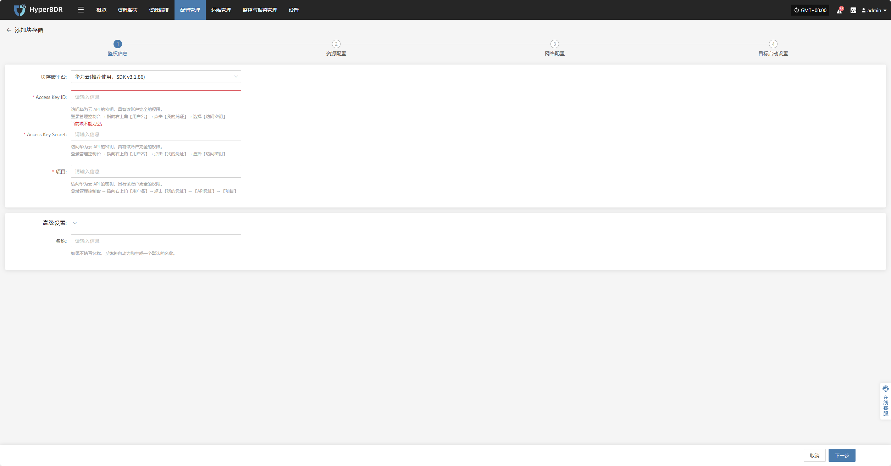

* **鉴权信息说明**

| **配置项**           | **示例值**                          | **说明**                                                                      |
| ----------------- | -------------------------------- | --------------------------------------------------------------------------- |
| 块存储平台             | 华为云(推荐使用，SDKv3.1.86)             | 华为云(推荐使用，SDKv3.1.86)                                                        |
| Access Key ID     | HPUAAG0B2•••••••••••••••         | 访问华为云 API 的密钥，具有该账户完全的权限。&#xA;登录管理控制台 → 指向右上角【用户名】→ 点击【我的凭证】→ 选择【访问密钥】      |
| Access Key Secret | •••••••••••••••••••••••••••••••• | 访问华为云 API 的密钥，具有该账户完全的权限。&#xA;登录管理控制台 → 指向右上角【用户名】→ 点击【我的凭证】→ 选择【访问密钥】      |
| 区域                | cn-east-5                        | 访问华为云 API 的密钥，具有该账户完全的权限。&#xA;登录管理控制台 → 指向右上角【用户名】→ 点击【我的凭证】→ 【API凭证】→ 【项目】 |
| 名称                | test                             | 如果不填写名称，系统将自动为您生成一个默认的名称。                                                   |

鉴权信息填写完毕后，点&#x51FB;**"下一步"**&#x5F00;始进&#x884C;**"资源配置"**

### **资源配置**

为云同步网关分配计算、存储资源，确保其在目标环境中稳定高效运行。

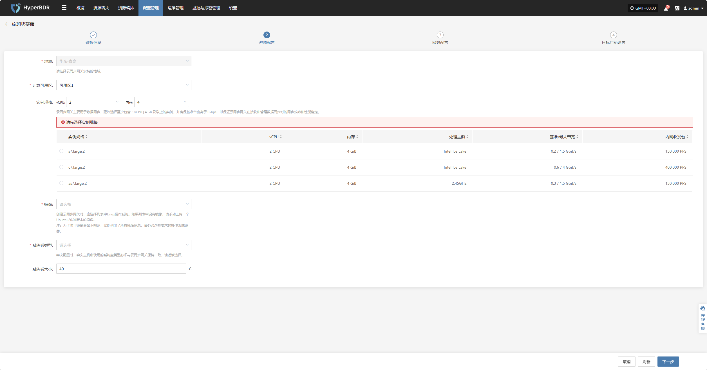

* **资源配置说明**

| **配置项**     | **示例值**                                   | **说明**                                                                                                                             |
|----------------|----------------------------------------------|--------------------------------------------------------------------------------------------------------------------------------------|
| 区域           | 华东-青岛                                     | 请选择云同步网关安装的地域                                                                                                           |
| 可用区         | 可用区1                                       | 可通过下拉列表选择对应区域内的可用区                                                                                                 |
| 实例规格        | 可通过下拉列表按需选择 vCPU 和内存，选择后自动刷新下列示例规格，具体以实际为准 | 云同步网关主要用于数据同步，建议选择至少包含 2 vCPU \| 4 GB 及以上的实例，并确保基准带宽高于 1 Gbps， 以保证云同步网关在接收和管理数据同步时的同步效率和性能稳定。 |
| 镜像           | 通过下拉列表选择对应 Linux 主机镜像                     | 创建云同步网关时，应选择列表中 Linux 操作系统。 如果列表中没有镜像，请手动上传一个 Ubuntu 20.04 版本的镜像。 注：为了防止镜像命名不规范，此处列出了所有镜像信息，请务必选择要求的操作系统镜像。 |
| 系统卷类型      | 通用型 SSD (gp2)                             | 具体以实际为准                                                                                                                       |
| 系统卷大小      | 用户自定义（视实例需求而定）                            | 根据同步网关工作负载选择合适大小，默认为 40G                                                                                         |

### **网络配置**

为云同步网关分配网络资源，确保其在目标环境中稳定高效运行。

* **网络配置说明**

| **配置项** | **示例值**                                                 | **说明**                                                                     |
| ------- | ------------------------------------------------------- | -------------------------------------------------------------------------- |
| 专有网络    | project-vpc (xxx.xxx.xxx.xxx/xx)                        | 通过下拉列表选择云同步网关所属的私有网络，具体以实际为准                                               |
| 子网      | project-subnet-public1-cn-north-1a (xxx.xxx.xxx.xxx/xx) | 通过下拉列表选择所属可用区中的子网，具体以实际为准                                                  |
| 指定私有 IP | 自动分配 IP 地址                                              | 默认为自动分配，如需指定可通过下拉列表选择手动分配IP地址，云同步网关使用的IP地址，默认为自动分配。指定该IP地址时，请确认该IP地址没有被占用。 |

* **网络高级设置**

| **配置项**         | **示例值**                                                                                                     | **说明**                                                                                                               |
|--------------------|---------------------------------------------------------------------------------------------------------------|------------------------------------------------------------------------------------------------------------------------|
| 云同步网关控制网络   | 内网 / 公网                                                                                                   | 设置控制台与云同步网关之间的控制指令下发网络，例如：在使用 VPN 或者专线时，应当选择内网。                                      |
| 自定义控制网络      | 输入 IPv4 / IPv6 / 域名                                                                                         | 默认情况下无需配置。 只有在按需连接时（例如：进行 NAT 地址转换时）才需要进行配置。 支持输入 IPv4、IPv6 地址和域名。         |
| 数据传输网络       | 内网 / 公网                                                                                                   | 设置源端与云同步网关之间进行数据传输的网络，例如：在使用 VPN 或者专线时，应当选择内网。                                      |
| 自定义数据传输网络   | 输入 IPv4 / IPv6 / 域名                                                                                         | 默认情况下无需配置。 只有在按需连接时（例如：进行 NAT 地址转换时）才需要进行配置。 支持输入 IPv4、IPv6 地址和域名。         |
| 驱动适配网络方式     | 公网网络不使用代理 内网网络不使用代理 公网网络并通过云同步网关代理 内网网络并通过云同步网关代理       | 驱动适配主机的网络连接方式                                                                                             |
| 公网带宽          | 200 Mbps                                                                                                    | 根据实际场景填写 1–200 Mbps 的带宽值，它会影响从源端到目标端数据传输的速率。                                              |

* **数据传输高级设置**

| **配置项** | **可选值**                   | **说明**                                                                                 |
| ------- | ------------------------- | -------------------------------------------------------------------------------------- |
| 数据传输协议  | S3Block / iSCSI(即将退役，不推荐) | 该选项是源端与同步网关之间的数据传输协议。&#xA;S3Block 在广域网中应用广泛，更加适合数据传输。&#xA;iSCSI 协议用于存储网络，适用于网络环境稳定的场景。 |

* **备份卷高级设置**

| **配置项** | **可选值** | **说明**                |
| ------- | ------- | --------------------- |
| 大备份卷    | 23 / 59 | 当选择59时(平台限制:仅支持23台主机) |

网络配置完毕后，点&#x51FB;**"下一步"**&#x5F00;始进&#x884C;**"目标启动设置"**

### **目标启动设置**

用于配置目标端在恢复或演练过程中启动所需的关键参数，确保资源能够顺利接管与运行。

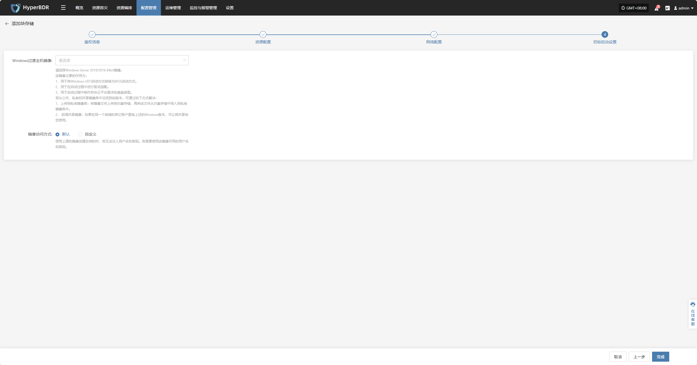

* **目标启动设置说明**

| **配置项**             | **示例值**                                          | **说明**                                                                                                                                                                                                                                                                                                                                                                                                                                                                                                                                                                                                                                     |
|------------------------|-----------------------------------------------------|----------------------------------------------------------------------------------------------------------------------------------------------------------------------------------------------------------------------------------------------------------------------------------------------------------------------------------------------------------------------------------------------------------------------------------------------------------------------------------------------------------------------------------------------------------------------------------------------------------------------------------------------|
| Windows过渡主机镜像     | Windows Server-2019-English-Full-Base-2025.05.15    | 该镜像主要的作用为： 1、用于将Windows UEFI启动方式转换为BIOS启动方式。 2、用于在启动过程中进行驱动适配。 3、用于启动过程中制作符合云平台需求的磁盘类型。  若从公共、私有和共享镜像库中没找到该版本，可通过如下方式解决： 1、上传到私有镜像库：将镜像文件上传到对象存储，再将该文件从对象存储中导入到私有镜像库中。 2、获得共享镜像：如果在同一个地域的其它账户里有上述的Windows版本，可让其共享给您使用。 |
| 镜像访问方式           | 默认 / 自定义                                       | 使用上面的镜像创建实例的时，若无法注入用户名和密码，则需要使用该镜像可用的用户名和密码。                                                                                                                                                                                                                                                                                                                                                                                                                                                                                                                                                                                              |

目标启动设置完成后，点&#x51FB;**“完成”**，系统将开始自动创建云同步网关及过渡主机镜像

### **查看详情**

创建过程中，点击“点击查看列表”即可查看创建云同网关详细列表。

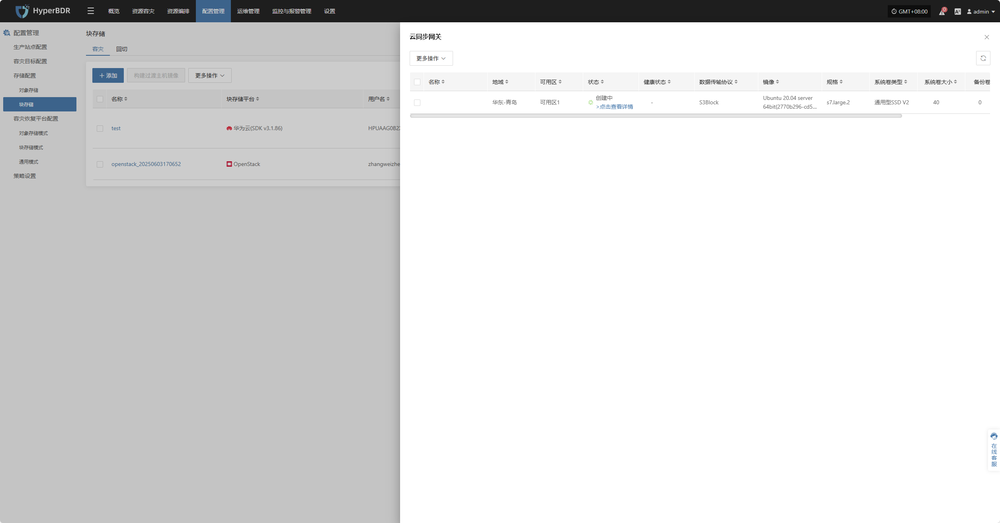

选择相应主机并点击“点击查看详情”，可查看任务创建过程中产生的详细日志，便于快速掌握执行状态以及故障排除。

## **更多操作**

### **修改**

点击“修改”，可对鉴权信息进行编辑操作

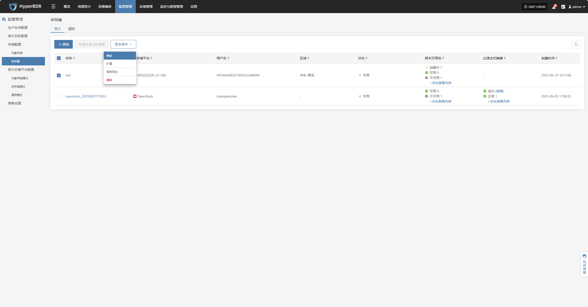

### **扩展**

点击“扩展”，可对资源配置、网络配置、标启动设置，进行修改编辑操作

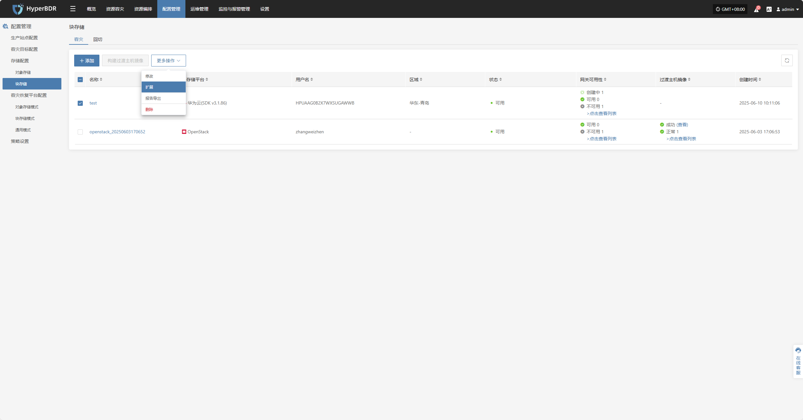

### **报告导出**

点击“报告导出”，可导出对应云同步网关报告信息

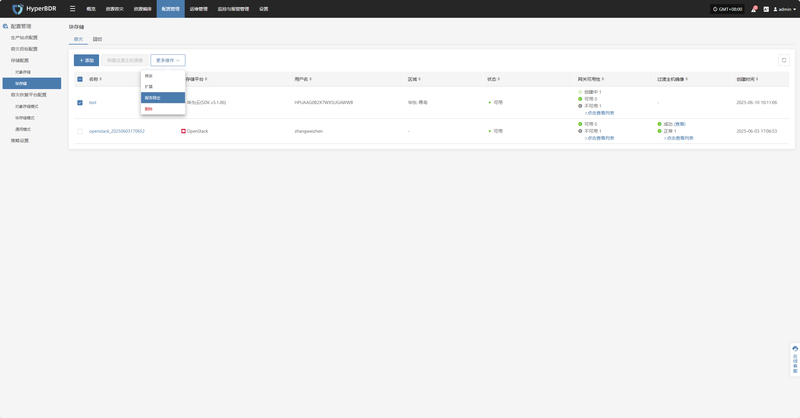

选择对应报告类型，采集范围，时区，时间范围点击下一步，可选择需要导出报告的主机

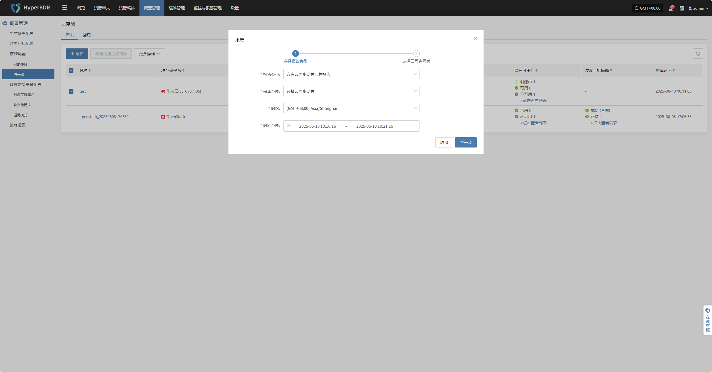

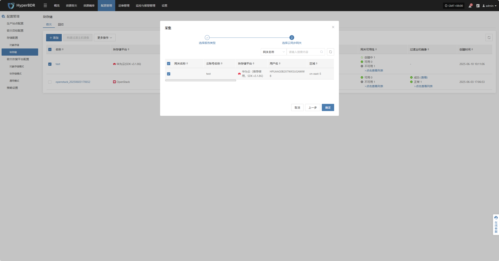

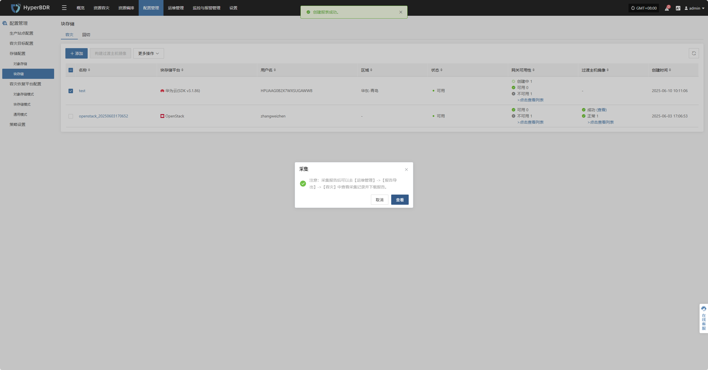

### **删除**

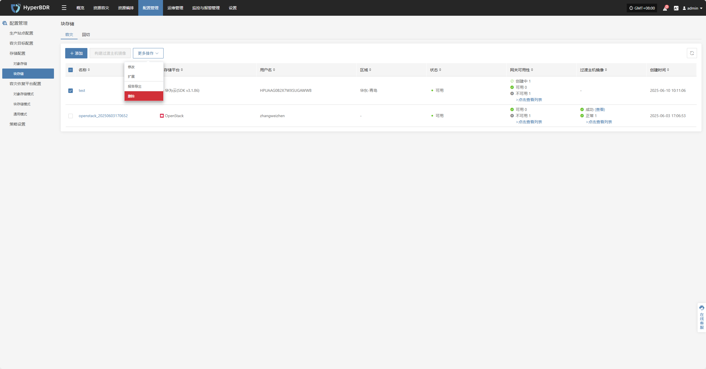

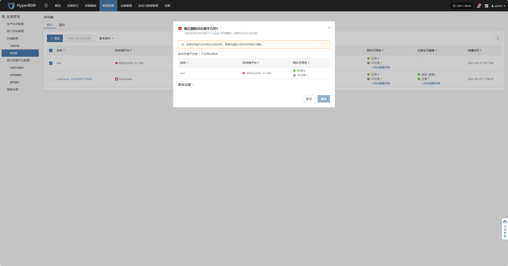