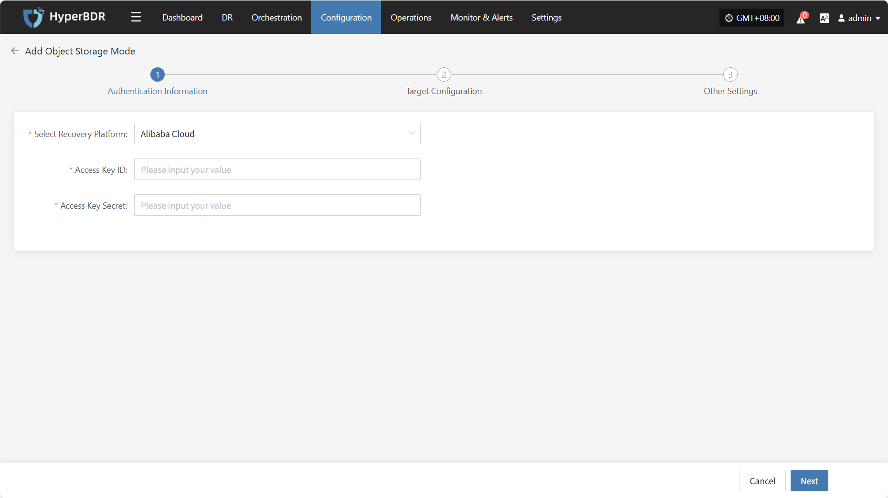
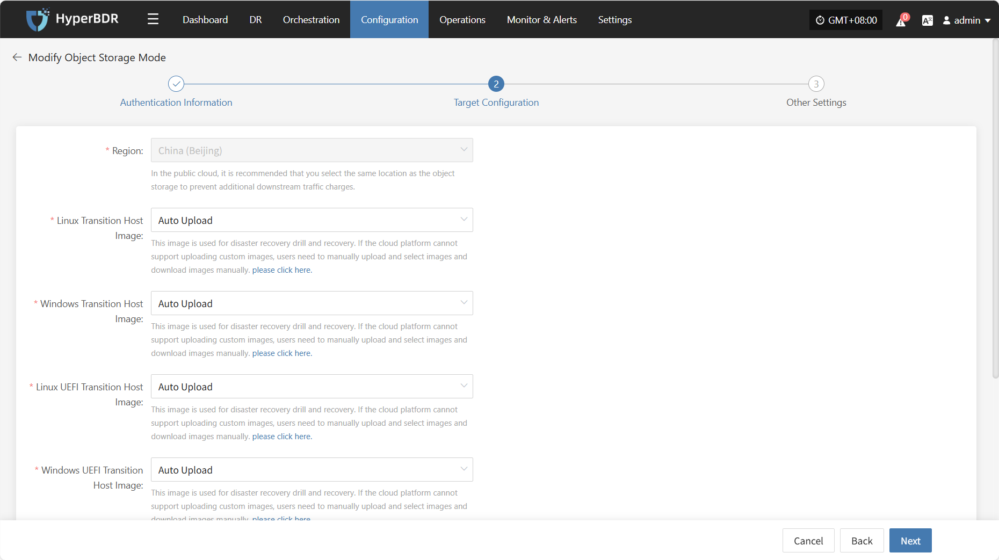
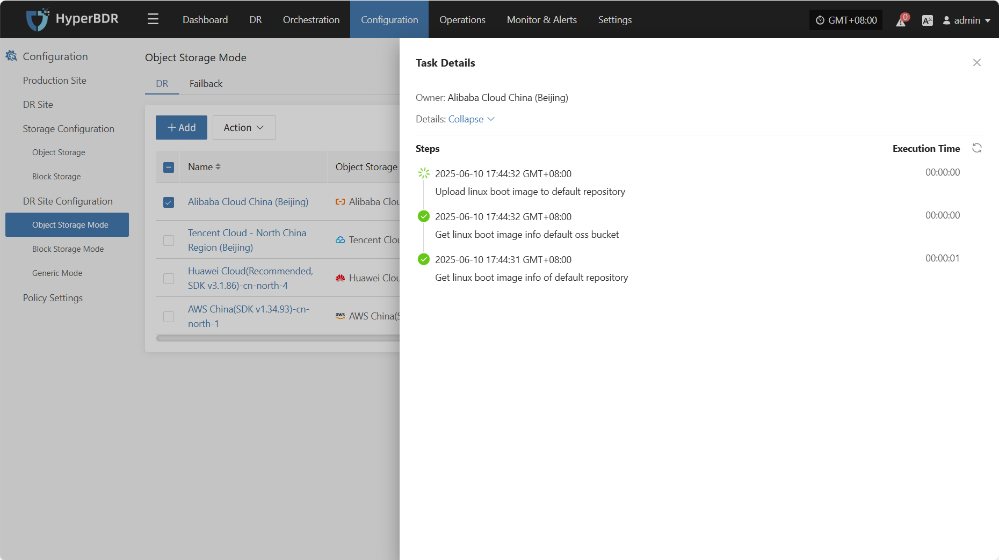
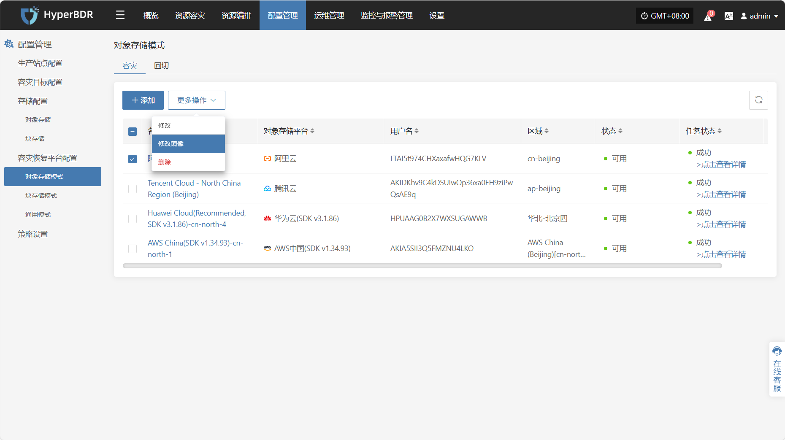
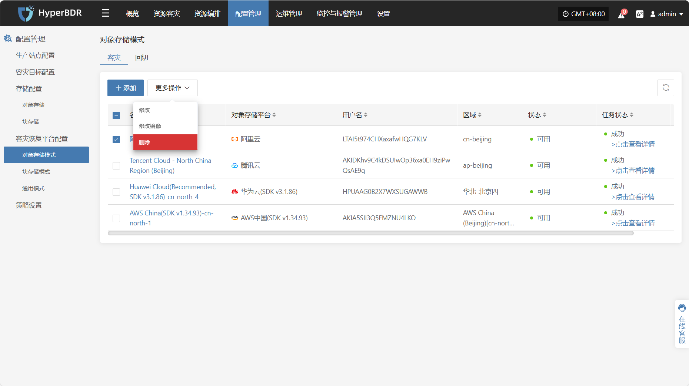
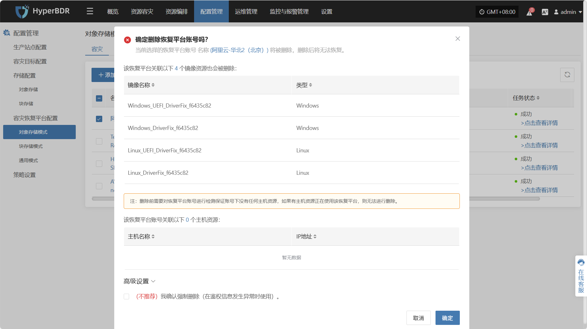

# **阿里云**

## **添加对象存储**

通过顶部导航栏依次选择 **“配置管理” → “容灾恢复平台配置” → “对象存储”** 进入对象存储页面，点击右上角 “添加” 按钮，可进行对象存储的新增配置操作。

### **鉴权信息**

选择恢复平台通过下拉列表选择“阿里云”，根据接入对象存储的实际情况，填写以下平台鉴权信息：

* **鉴权信息说明**

| **配置项**           | **示例值**                          | **说明**                                                 |
| ----------------- | -------------------------------- | ------------------------------------------------------ |
| 块存储平台             | 阿里云                              | 通过下拉列表找到并选择阿里云                                         |
| Access Key ID     | HPUAAG0B2•••••••••••••••         | 访问阿里云 API 的密钥，具有该账户完全的权限，登录管理控制台→右上角个人信息→【Accesskey管理】 |
| Access Key Secret | •••••••••••••••••••••••••••••••• | 访问阿里云 API 的密钥，具有该账户完全的权限，登录管理控制台→右上角个人信息→【Accesskey管理】 |

鉴权信息填写完毕后，点&#x51FB;**"下一步"**&#x5F00;始进&#x884C;**"目标配置"**

### **目标配置**

* **目标配置说明**

| **配置项**             | **示例值**      | **说明**                                                                                                                                                                                     |
| ------------------- | ------------ | ------------------------------------------------------------------------------------------------------------------------------------------------------------------------------------------ |
| 地域                  | 华北2（北京）      | 通过下拉列表选择合适的地域，公有云中建议您选择与对象存储相同的区域，防止产生额外的下行流量费用                                                                                                                                            |
| Linux过渡主机镜像         | 自动上传         | 该镜像用于容灾演练和恢复，如果云平台无法支持上传自定义镜像，需要用户手动上传后进行选择，手动下载镜像。可在界面点击跳转下载页面                                                                                                                            |
| Windows过渡主机镜像       | 自动上传         | 该镜像用于容灾演练和恢复，如果云平台无法支持上传自定义镜像，需要用户手动上传后进行选择，手动下载镜像。可在界面点击跳转下载页面                                                                                                                            |
| Linux UEFI 过渡主机镜像   | 自动上传         | 该镜像用于容灾演练和恢复，如果云平台无法支持上传自定义镜像，需要用户手动上传后进行选择，手动下载镜像。可在界面点击跳转下载页面                                                                                                                            |
| Windows UEFI 过渡主机镜像 | 自动上传         | 该镜像用于容灾演练和恢复，如果云平台无法支持上传自定义镜像，需要用户手动上传后进行选择，手动下载镜像。可在界面点击跳转下载页面                                                                                                                            |
| 控制台访问过渡主机网络         | 内网 / 公网 | 该选项主要用于：&#xA;1、在初始化过程中，需要创建过渡主机镜像，当创建镜像时，用于控制台与该过渡主机进行通讯的网络。&#xA;2、在启动过程中，配置容灾控制台与过渡主机之间的通讯网络。&#xA;配置建议：&#xA;① 私有云中，如果容灾控制台可以与云主机自身地址进行直接通讯，应选择内网进行通讯。&#xA;② 公有云中，如果没有进行特殊的专线配置，应选择外网进行通讯。 |
| 名称                  | 阿里云-华北2（北京）  | 如果不输入ID则会自动生成                                                                                                                                                                              |

目标配置完毕后，点&#x51FB;**"下一步"**&#x5F00;始进&#x884C;**"其他设置"**

### **其他设置**

* 其他设置说明

| 配置项                       | 示例值                              | 说明                                                                                                                                                                                                                                                                                      |
| ------------------------- | -------------------------------- | --------------------------------------------------------------------------------------------------------------------------------------------------------------------------------------------------------------------------------------------------------------------------------------- |
| Windows过渡主机镜像 (UEFI转BIOS) | Windows Server 2016 数据中心版 64位中文版 | 请选择Windows Server 2019/2016 64bit镜像。&#xA;该镜像主要的作用为：&#xA;1、用于将Windows UEFI启动方式转换为BIOS启动方式。&#xA;2、用于在启动过程中进行驱动适配。&#xA;3、用于启动过程中制作符合云平台需求的磁盘类型。&#xA;若从公共、私有和共享镜像库中没找到该版本。可通过如下方式解决：&#xA;1、上传到私有镜像库：将镜像文件上传到对象存储，再将该文件从对象存储中导入到私有镜像库中。&#xA;2、 获得共享镜像：如果在同一个地域的其它账户里有上述的Windows版本，可让其共享给您使用。 |

其他设置完成后，点击 **“完成”** ，系统将开始自动创建过渡主机镜像

### **查看详情**

创建过程中，点击“点击查看详细”可查看任务创建过程中产生的详细日志，便于快速掌握执行状态以及故障排除。

## **更多操作**

### **修改**

点击“修改”，可对鉴权信息，目标配置，其他设置进行编辑操作

### **修改镜像**

点击“修改镜像”，可对过渡主机镜像进行重建操作

> 注：如果选择【自动上传】选项，点击【确定】按钮后，会先删除以前自动上传的镜像，再自动上传一个新的镜像。

### **删除**

