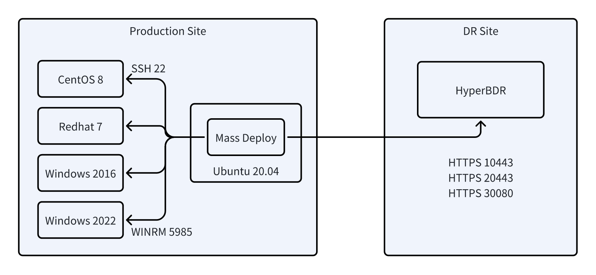

# Agent 批量安装

## 1. 概述

本手册适用于 HyperMotion 和 HyperBDR 的 Linux 和 Windows Agent 批量安装，以及 HyperBDR 回滚 Agent 的批量安装和升级。

在执行过程中，如果出现任务失败，系统将只重试失败的任务，以提高安装效率。

## 2. 安装环境要求

### 2.1 运行环境

批量安装程序需要独立部署，建议在生产环境中运行。具体要求如下：

- 操作系统：Ubuntu 20.04
- 容器环境：Docker

### 2.2 网络架构



## 3. 主机要求

| 操作系统 | 限制条件 | 网络要求 | 权限要求 |
|---------|---------|---------|---------|
| Windows | ✅ Windows Server 2012 及以上版本<br>❌ 不支持 Windows Server 2008 及以下版本（需要额外系统补丁） | - 必须启用 WinRM 服务<br>- 确保 5985 端口可访问 | 必须使用 Administrator 用户 |
| Linux | Python ≥ 2.7（低版本需要手动安装） | 必须支持 SSH 连接 | ✅ 支持 root 用户直接安装<br>✅ 支持 sudo 权限安装（需配置免密切换） |

## 4. 工具准备

### 4.1 工具安装

```bash
# 拉取部署镜像
docker pull registry.cn-beijing.aliyuncs.com/oneprocloud-opensource/massdeploy:latest
```

### 4.2 工具验证

```bash
docker run --rm registry.cn-beijing.aliyuncs.com/oneprocloud-opensource/massdeploy:latest mass-deploy -version
# 输出：mass-deploy 2025-02-27

docker run --rm registry.cn-beijing.aliyuncs.com/oneprocloud-opensource/massdeploy:latest hyperbdr -version
# 输出：hyperbdr 0.0.1
```

## 5. 批量安装流程

### 5.1 配置主机列表

```bash
mkdir -p ./mass-deploy && cd ./mass-deploy
```

创建 `hosts_to_install.csv`（[下载](/attachments/hosts_to_install.csv)）文件用于批量安装。字段说明如下：

| 字段名 | 是否必填 | 说明 |
|--------|---------|------|
| ip | 是 | 主机可访问的 IP 地址 |
| protocol | 是 | 通信协议（winrm/ssh） |
| port | 是 | 服务端口（WinRM:5985 / SSH:22） |
| username | 是 | 认证用户名 |
| password | 是 | 认证密码/密钥文件路径（密钥必须与 CSV 在同一目录）<br>密钥文件权限应设置为 600<br>建议使用相对路径指定密钥文件 |
| os_type | 是 | 操作系统类型（windows/linux） |
| tag | 否 | 程序自动生成，任务标签，空白表示未设置标签 |
| hostname | 否 | 程序自动生成，主机名，空白表示未获取主机名 |
| os_name | 否 | 程序自动生成，操作系统名称，空白表示未识别操作系统 |
| status | 否 | 程序自动生成，任务状态：deploying=部署中，success=成功，failed=失败 |
| node_uuid | 否 | 程序自动生成，HyperBDR 注册 ID，空白表示未注册 |
| error | 否 | 程序自动生成，错误详情，部署失败时显示 |

### 5.2 启动部署容器

```bash
docker run -itd --rm --name massdeploy \
  -v $(pwd):/root \
  registry.cn-beijing.aliyuncs.com/oneprocloud-opensource/massdeploy:latest bash
```

### 5.3 目标主机连通性检查

```bash
docker exec massdeploy mass-deploy ping
```

对于无法访问的机器，状态将更改为 `unreachable`。后续的连通性检查将只检查状态为 `unreachable` 的主机。示例输出：

```
# docker exec massdeploy mass-deploy ping
2025-02-27 05:54:29,432 - INFO - 当前工作目录为 /root
2025-02-27 05:54:29,433 - INFO - 成功读取 3 台主机
2025-02-27 05:54:34,345 - INFO - 主机 192.168.8.21 正常
2025-02-27 05:54:34,384 - INFO - 主机 192.168.8.22 正常
2025-02-27 05:54:35,103 - WARNING - 主机 192.168.8.23 无法访问，通过 ssh 连接主机失败：ssh: connect to host 192.168.8.23 port 22: No route to host
2025-02-27 05:54:36,803 - INFO - 主机检查完成。共测试 3 台主机，1 台主机连通性检查失败。
2025-02-27 05:54:36,803 - INFO - CSV 文件已成功保存。
```

### 5.4 获取 Agent 安装包

```bash
docker exec massdeploy bash download-hyperbdr-agent <控制台IP>:端口 <用户名> <密码>
```

- HyperBDR 控制台地址通常为：`https://<控制台IP>:10443`
- HyperBDR 回滚控制台地址通常为：`https://<控制台IP>:20443`
- HyperMotion 控制台地址通常为：`https://<控制台IP>:20443`

执行成功后，将在 `mass-deploy` 文件夹下创建 `agents` 目录，包含以下四个文件：

```
install-cli.bat
linux_agent.sh
Windows_server_32bit_beta.zip
Windows_server_64bit_beta.zip
```

### 5.5 执行批量部署

```bash
docker exec massdeploy mass-deploy deploy
```

部署完成后，成功的主机状态为 `success`，失败的主机状态为 `failed`。

示例输出：

```
[root@localhost ~]# docker exec massdeploy mass-deploy deploy
2025-02-27 06:14:40,538 - INFO - 当前工作目录为 /root
2025-02-27 06:14:40,538 - INFO - 成功读取 2 台主机
2025-02-27 06:14:40,539 - INFO - 开始部署 0 台主机。共 2 台主机，剩余 1 台。
2025-02-27 06:14:40,539 - INFO - 开始部署 1 台主机。共 2 台主机，剩余 1 台。
2025-02-27 06:14:48,181 - ERROR - 主机 192.168.7.232 部署失败，信息 {"msg": "linux agent 已存在", "_ansible_no_log": null, "changed": false}
2025-02-27 06:14:48,182 - INFO - CSV 文件已成功保存。
2025-02-27 06:17:23,404 - INFO - 主机 192.168.7.235 已成功部署。
2025-02-27 06:17:23,404 - INFO - CSV 文件已成功保存。
2025-02-27 06:17:23,405 - INFO - CSV 文件已成功保存。
```

成功主机日志示例：

```
INFO - 主机 192.168.7.235 已成功部署。
```

失败主机日志示例：

```
ERROR - 主机 192.168.7.232 部署失败，信息 {"msg": "linux agent 已存在", "_ansible_no_log": null, "changed": false}
```

## 6. 批量升级流程

本工具支持 Agent 的批量升级，也可以通过产品页面进行升级。

在控制端完成升级后，需要获取升级包并执行升级命令。

### 6.1 配置升级主机列表

创建 `hosts_to_upgrade.csv`（[下载](/attachments/hosts_to_upgrade.csv)）文件用于批量升级。

### 6.2 获取升级包

```bash
# 下载升级包
wget -O ./agents/upgrade_x86.zip https://<控制台IP>:30080/softwares/windows-agent-new/upgrade_x86.zip
wget -O ./agents/upgrade_agent.sh https://<控制台IP>:30080/softwares/upgrade_agent.sh
```

### 6.3 执行批量升级

```bash
docker exec massdeploy mass-deploy upgrade
```

## 7. 高级功能

### 7.1 批量命令执行

:::warning
本工具支持批量命令执行，允许您自定义要执行的命令，但不支持脚本。
:::

```bash
docker exec massdeploy mass-deploy -t unsupported_kernel shell -os linux "uname -a"
```

- 查询主机内核版本：

```bash
docker exec massdeploy mass-deploy shell -os linux "uname -a"
```

- 检查主机是否可以连接 HyperBDR：

```bash
docker exec massdeploy mass-deploy shell -os linux ping -c 2 -w 5 <HyperBDR控制台IP>
```

## 附录

### 如何在 Ubuntu 20.04 上安装 Docker？

```bash
# 更新现有软件包列表
sudo apt update

# 安装必要的软件包，允许 apt 通过 HTTPS 使用仓库
sudo apt install apt-transport-https ca-certificates curl software-properties-common

# 添加 Docker 的官方 GPG 密钥
curl -fsSL https://download.docker.com/linux/ubuntu/gpg | sudo apt-key add -

# 添加 Docker 稳定版仓库
sudo add-apt-repository "deb [arch=amd64] https://download.docker.com/linux/ubuntu $(lsb_release -cs) stable"

# 再次更新软件包列表
sudo apt update

# 安装 Docker
sudo apt install docker-ce

# 启动 Docker 并设置开机自启
sudo systemctl start docker
sudo systemctl enable docker
```

### 常见错误信息

| 错误信息 | 原因分析 |
|---------|---------|
| `linux agent 目录已存在` | 目标主机已存在 Agent 安装目录 |
| `cat: /var/lib/egisplus-agent/registered: No such file or directory` | Agent 服务未成功注册（通常由于服务启动失败） |
| `抱歉，当前内核版本 ... 不受支持` | Linux 内核版本不兼容 |
| `ansible-core 需要 Python2 最低版本 2.7...` | Python 运行时版本过低 |

## 版本更新日志

| 日期 | 更新内容 |
|------|---------|
| **2024/12/06** | ✅ 新增标签过滤功能<br>✅ 支持按指定标签/IP 执行任务 |
| **2024/12/02** | 🔄 代码架构重构<br>⏱️ 优化超时机制（检查 60s/部署 10min） |
| **2024/11/29** | 🚦 新增不可达状态识别<br>⏭️ 自动跳过不可达主机 |
| **2024/11/28** | 👥 支持 Linux 非 root 用户部署 |
| **2024/11/27** | 🛠️ 优化 Windows QEMU Guest Agent 服务处理逻辑 |
