# **报警器**

为保障系统运行的安全性、稳定性以及关键事件的可观测性，系统内置报警器功能，用于实时监控迁移主机的运行状态与资源使用情况，并在检测到异常时触发告警通知，帮助运维人员及时发现并处理问题，降低对业务系统的潜在影响。

> **最佳报警配置实践**可参考《运维指南》中的“监控与报警管理 → 报警配置最佳实践”章节，以获取详细的配置建议和操作指导。

## **资源报警器**

在系统菜单中依次进入：
**监控与报警管理 → 报警器 → 资源报警器 → 创建报警器**

进入创建页面后，根据实际需求配置相关参数并保存，即可完成**迁移**、**回切**报警器创建。

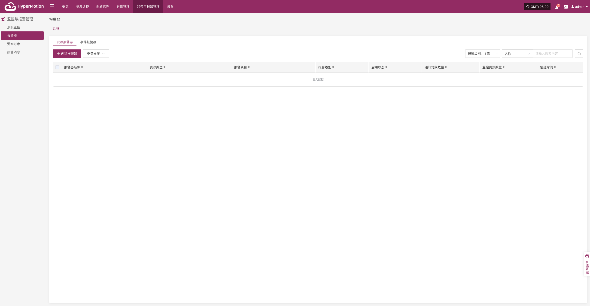

### **创建报警器**

#### **报警器配置字段说明**

| **字段名称** |   **信息/示例**    | **说明**                                                                                                                             |
| :----------: | :----------------: | ------------------------------------------------------------------------------------------------------------------------------------ |
|  报警器类型  |     资源报警器     | 选择报警器所属的分类或用途类型，用于区分不同类型的监控策略。                                                                         |
|  报警器名称  |        test        | 自定义报警器名称，用于识别和管理报警器。                                                                                             |
|   报警级别   |        严重        | 指定报警的严重程度，例如：提示、严重、紧急。                                                                                         |
|   启用状态   |       已启用       | 设置报警器是否启用，启用后系统将按照配置进行监控和告警。                                                                             |
|   资源类型   |    源端同步代理    | 表示报警器监控的资源种类。常见资源类型包括： + 源端同步代理 + 云同步网关 + Linux Agent + Windows Agent + 对象存储资源 |
|   监控资源   |     ubuntu-ova     | 选择需要监控的资源对象（可添加多个），系统将根据配置对这些资源进行持续监控。                                                         |
|   报警条目   |        CPU         | 设置要监控的具体指标项。支持项包括： + CPU + 磁盘 + 内存 + 进程                                                          |
| 报警触发规则 | ≥ 80%，持续 5 分钟 | 设置告警触发的条件，例如当某指标超过某值且持续一定时间后触发报警。                                                                   |
|   报警周期   |       5 分钟       | 配置系统进行报警检测的时间间隔，表示多久检测一次指标状态。                                                                           |
|   通知对象   |                    | 设置报警触发后要通知的对象（可为用户或用户组）。                                                                                     |
|  报警器描述  |                    | 可选填写，用于记录报警器的用途或相关说明，方便管理与查看。                                                                           |

#### **监控资源类型说明**

| **资源类型**  | **报警条目**          | **说明**                                  |
| ------------- | --------------------- | ----------------------------------------- |
| 源端同步代理  | CPU、内存、磁盘、进程 | 监控源端同步代理资源使用情况及进程状态    |
| 云同步网关    | CPU、内存、磁盘、进程 | 监控云同步网关资源使用情况及进程状态      |
| Linux Agent   | CPU、内存、磁盘、进程 | 监控 Linux Agent 资源使用情况及进程状态   |
| Windows Agent | CPU、内存、磁盘、进程 | 监控 Windows Agent 资源使用情况及进程状态 |
| 对象存储资源  | 对象存储容量          | 监控存储容量的使用情况                    |

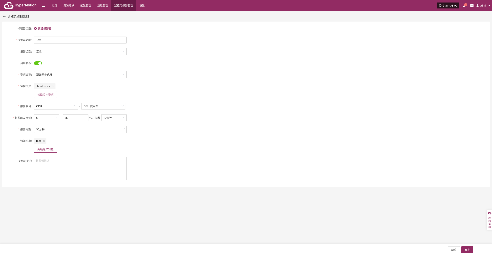

- 报警器创建完成后，系统将在对应事件发生时自动触发报警，并依据已关联的通知对象通过指定渠道发送通知。同时，相关报警信息将同步展示在平台的“报警消息”页面中，便于统一查看与处置。

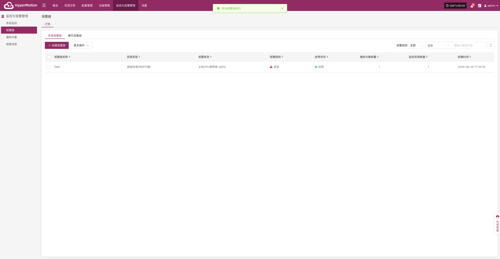

### **更多操作**

#### **修改**

- 点击【修改】后，系统将跳转页面，用户可在该页面对已创建的报警器配置进行重新编辑与调整。

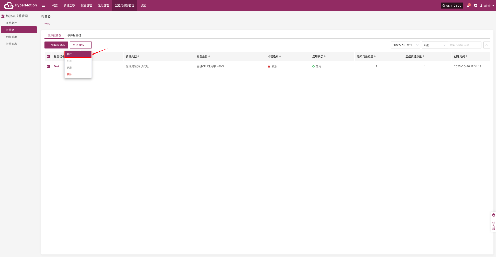

#### **启用**

- 已启用的报警器无法进行修改操作。如需变更相关配置，请先将报警器停用

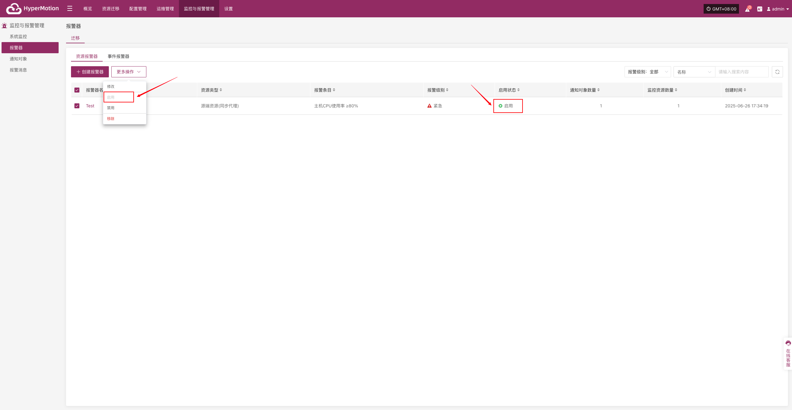

#### **停用**

- 已停的报警器无法进行修改操作。如需变更相关配置，请先将报警器起用

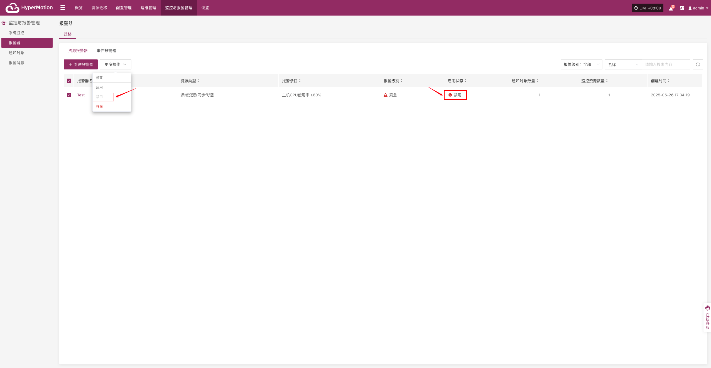

#### **移除**

- 点击【移除】后，移除操作将触发二次确认，确认后，系统将删除该报警器

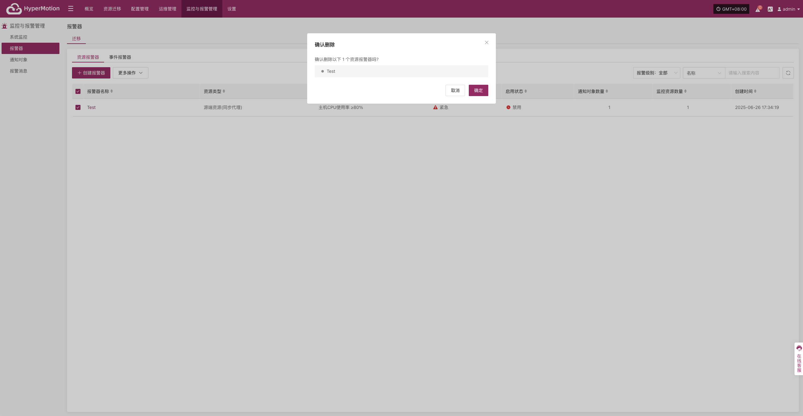

## **事件报警器**

在系统菜单中依次进入：
**监控与报警管理 → 报警器 → 事件报警器 → 创建报警器**

进入创建页面后，根据实际需求配置相关参数并保存，即可完成**迁移**报警器创建。

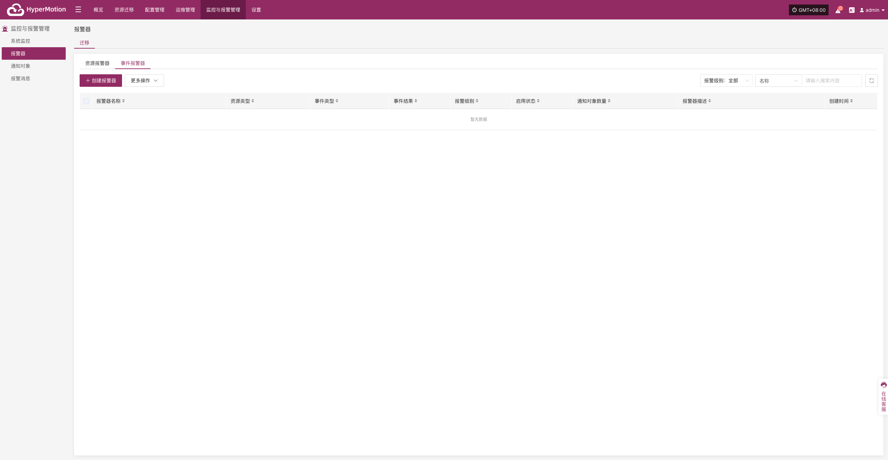

### **创建报警器**

#### **报警器配置字段说明**

| **字段名称** |    **信息**     | **说明**                                                                                                                                                                   |
| :----------: | :-------------: | -------------------------------------------------------------------------------------------------------------------------------------------------------------------------- |
|  报警器类型  |   事件报警器    | 设置报警器的类型。事件报警器用于监控关键操作行为与异常状态，触发事件时进行告警通知。                                                                                       |
|  报警器名称  |      test       | 用户自定义的报警器名称，用于识别和管理该报警器配置。                                                                                                                       |
|   报警级别   |      严重       | 报警事件的严重程度等级，例如：提示、严重、紧急等。                                                                                                                         |
|   启用状态   |     已启用      | 当前报警器是否处于启用状态，启用后系统将根据配置规则进行监控与告警。                                                                                                       |
|   事件类型   | 用户资源 / 登录 | 报警器监控的事件类型。支持类型包括： + 用户资源 + 迁移主机资源 + License 资源 + 生产平台资源 + 迁移平台资源 + 监控报警资源组 + 对象存储 + 迁移策略 |
|   事件结果   |      成功       | 指定事件的执行结果触发条件。例如： + 成功 + 失败                                                                                                                     |
|   通知对象   |  关联通知对象   | 报警触发后将通知的对象（人员或通知组），用于快速告知相关责任人。                                                                                                           |
|  报警器描述  |        —        | 对报警器的功能、配置目的等进行简要说明，便于识别与后续维护。                                                                                                               |

#### **事件类型说明**

| **事件类型** | **告警条件（部分示例）**                                                                                                          | **说明**                                             |
| ------------ | --------------------------------------------------------------------------------------------------------------------------------- | ---------------------------------------------------- |
| 用户资源     | 登录、退出登录、修改手机号、修改密码、找回密码                                                                                    | 涉及用户账户登录、身份认证、关键信息修改等行为事件。 |
| 主机资源     | 添加主机迁移配置、启动主机、清理资源、强制中止任务、主机失联/恢复、快照完整性检查、同步主机、接管主机迁移、资源限制配置相关操作等 | 与迁移主机的任务执行、状态监控、资源操作相关。       |
| License 资源 | 添加 License                                                                                                                      | 与系统授权状态、有效期、授权异常等相关的关键事件。   |
| 源端资源     | 添加/删除 Linux 或 Windows 代理、添加/删除/绑定源端同步代理及连接、虚拟机代理重载、连接状态变更等                                 | 涉及生产环境中代理程序的部署管理及其连接状态变化。   |
| 目标资源     | 添加/删除/修改云平台、创建/删除云同步网关及过程事件                                                                               | 与迁移平台架构组件的创建、修改、部署状态等相关操作。 |
| 监控报警     | 创建/修改/删除报警器与通知对象                                                                                                    | 与监控告警配置及告警发送机制相关的操作类事件。       |
| 对象存储     | 添加/删除/更新对象存储、开始添加/删除操作                                                                                         | 存储接入、配置变更、容量变化、访问异常等相关事件。   |
| 策略         | 创建/删除/修改策略、关联/分离策略                                                                                                 | 涉及迁移计划策略配置的生命周期管理。                 |

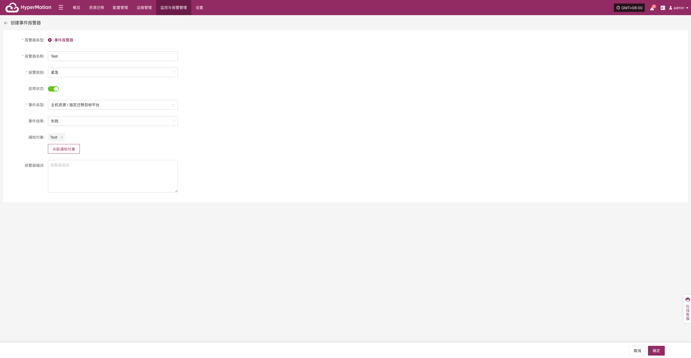

- 报警器创建完成后，系统将在对应事件发生时自动触发报警，并依据已关联的通知对象通过指定渠道发送通知。同时，相关报警信息将同步展示在平台的“报警消息”页面中，便于统一查看与处置。

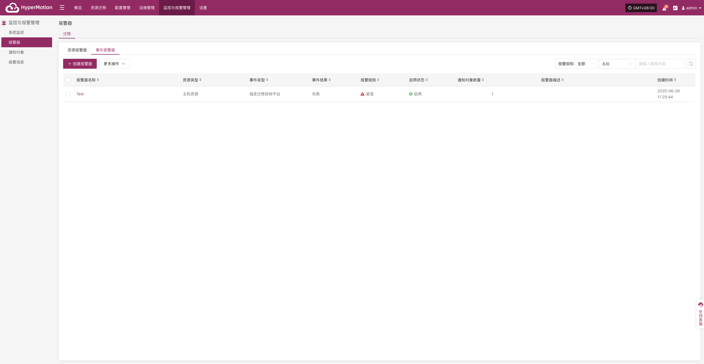

### **更多操作**

#### **修改**

- 点击【修改】后，系统将跳转页面，用户可在该页面对已创建的报警器配置进行重新编辑与调整。

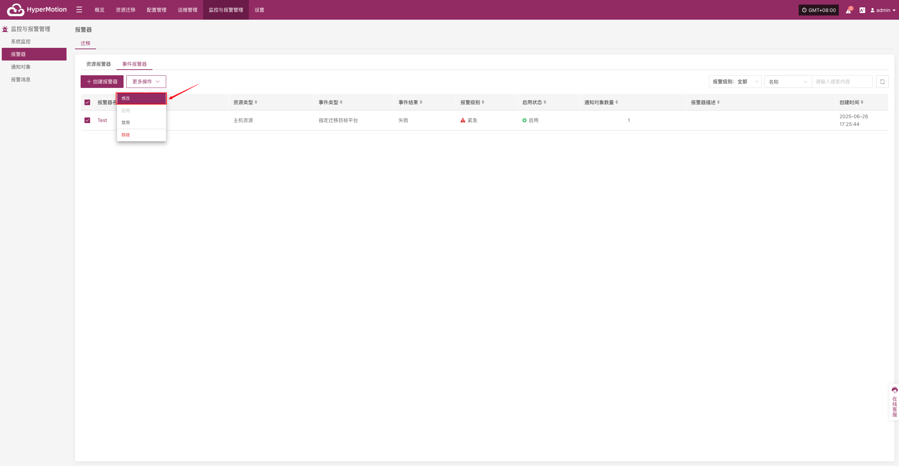

#### **启用**

- 已启用的报警器无法进行修改操作。如需变更相关配置，请先将报警器停用

#### **停用**

- 已停的报警器无法进行修改操作。如需变更相关配置，请先将报警器起用

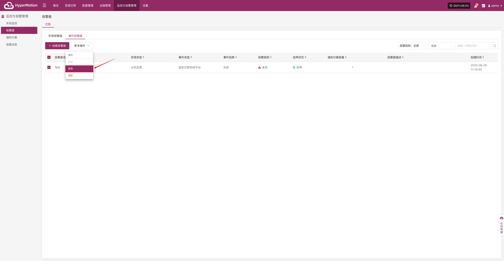

#### **移除**

- 点击【移除】后，移除操作将触发二次确认，确认后，系统将删除该报警器

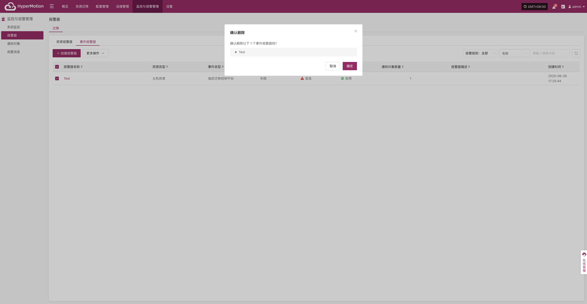
