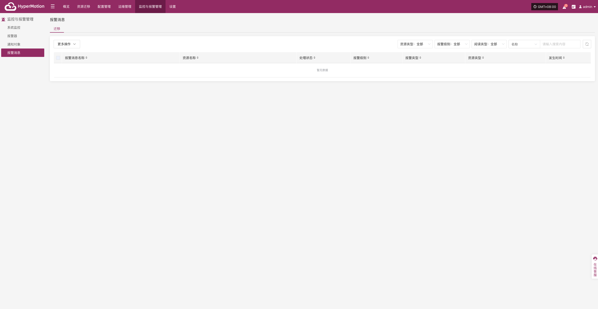
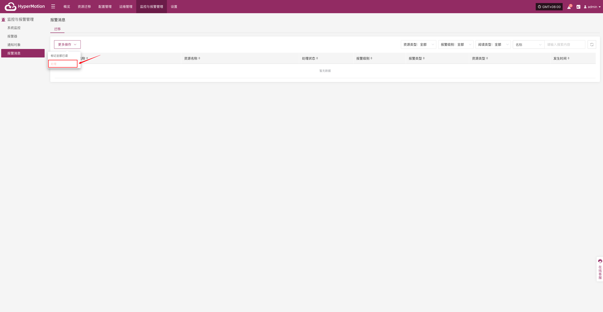

# 报警消息

系统在运行过程中，会根据报警器添加规则监控各类资源状态与关键事件。当检测到异常指标或触发预设告警条件时，平台将自动生成报警消息。

> 如果创建报警器时绑定相关通知人则会根据相应情况以邮件、短信或其他方式通知相关人员。

## 迁移

- 报警消息字段说明

系统在检测到资源异常或事件触发后，会生成报警消息，具体字段说明如下：

|     字段名称     | 描述                                                                                                                                           |
| :--------------: | ---------------------------------------------------------------------------------------------------------------------------------------------- |
| **报警消息名称** | 报警器触发时的事件类型，用于快速识别问题根因。                                                                                                 |
|   **资源名称**   | 触发报警的具体资源名称，例如主机名、服务名等。                                                                                                 |
|   **处理状态**   | 当前报警的处理进度或状态，如“未处理”、“已处理”等。                                                                                             |
|   **报警级别**   | 报警事件的严重程度，常见等级包括“提示”、“严重”、“紧急”等。                                                                                     |
|   **报警类型**   | 报警的具体类别，如“事件报警”、“资源报警”等。                                                                                                   |
|   **资源类型**   | 涉及的资源范围，包括： · 对象存储 · 同步策略 · 用户资源 · 主机资源 · License 资源 · 源端资源 · 目标资源 · 监控报警  |
|   **发生时间**   | 系统首次检测到该报警事件的时间点，用于问题溯源与响应时效分析。                                                                                 |

- 更多操作

在报警消息页面，用户可对报警事件进行操作处理，包括标记为“已读”或更新其处理状态，以便于后续追踪与管理。

处理后对应状态信息会进行改变：

