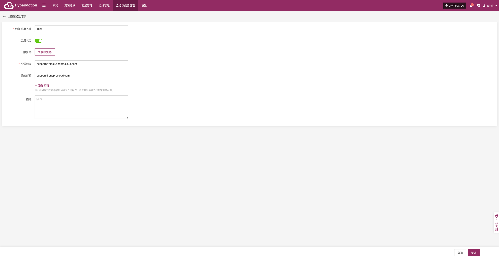
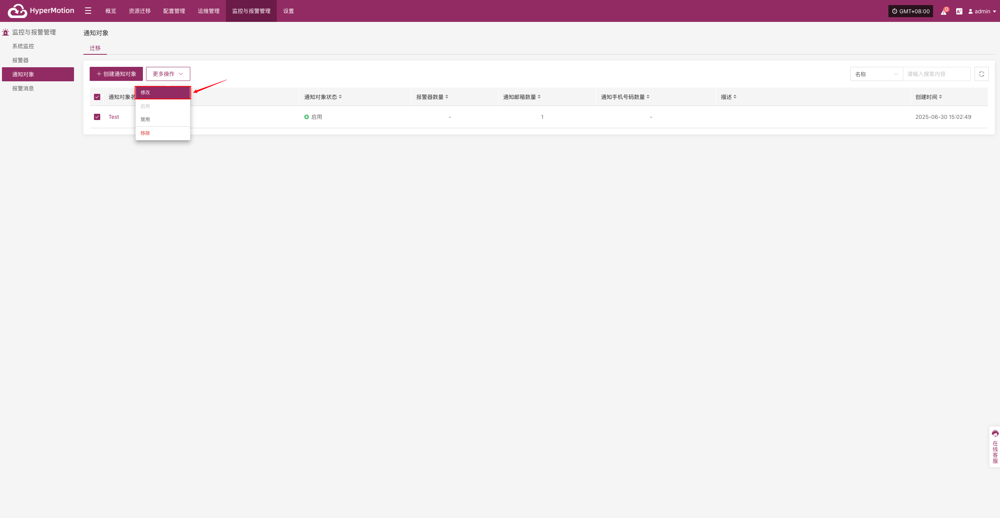
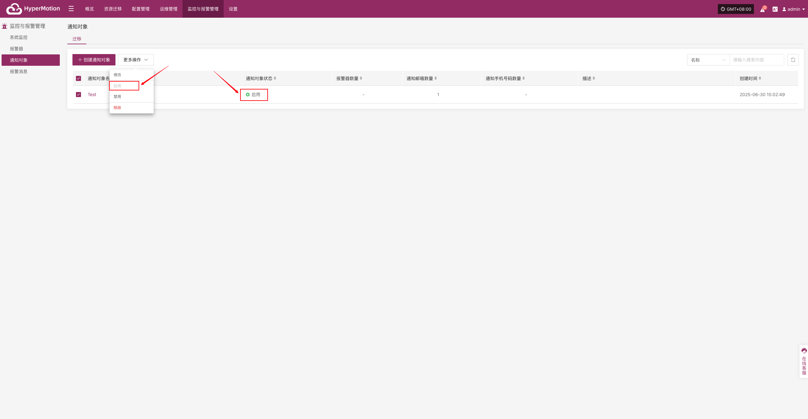
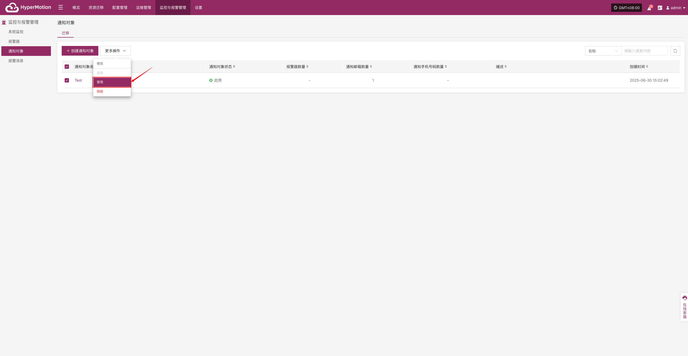
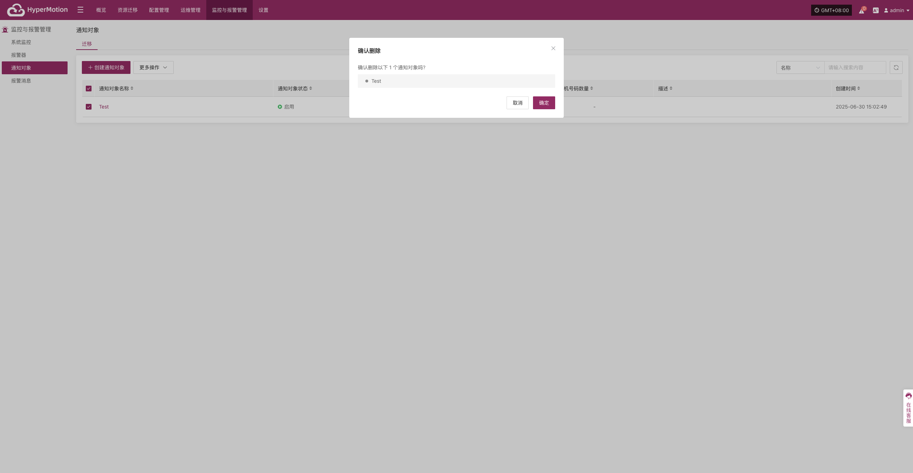

# 通知对象

报警事件发生时，系统将接收告警信息并进行响应的人员或群组。通知对象可以通过邮件、短信、电话或其他方式接收通知，确保相关人员及时了解并处理异常情况。

> 通知对象中尚未配置邮箱和短信接收服务时，无法创建通知用户，请到【运维管理平台】->【通知配置】中配置

## **迁移**

### **创建通知对象**

进入【监控与报警管理】模块，选择【通知对象】下的【迁移】，然后点击【创建通知对象】。

根据提示填写相关信息，完成通知对象的配置，确保报警事件发生时，相关人员能够及时收到通知。

| **字段名称** |     **字段信息**      |                **说明**                |
| :----------: | :-------------------: | :------------------------------------: |
| 通知对象名称 |         test          |             通知对象的名称             |
|   启用状态   |        已启用         |          当前通知对象是否启用          |
|    报警器    |         dame1         | 点击关联报警器，绑定已创建的报警器名称 |
|   发送通道   | dianzheng0410@163.com |      通知发送的渠道，例如邮箱地址      |
|   通知邮箱   |      XXX@qq.com       |    用于接收通知的邮箱（可添加多个）    |
|     描述     |                       |             相关备注或说明             |

### **更多操作**

选中相应的通知对象后，可执行包括修改、启用、停用及移除在内的管理操作。

#### **修改**

- 点击【修改】后，系统将跳转页面，用户可在该页面对已创建的报警器配置进行重新编辑与调整。

#### **启用**

- 已启用的通知对象无法进行修改操作。如需变更相关配置，请先将通知对象停用

#### **停用**

- 已停的通知对象无法进行修改操作。如需变更相关配置，请先将通知对象起用

#### **移除**

- 点击【移除】后，移除操作将触发二次确认，确认后，系统将删除该通知对象，并取消其与相关报警器的关联

