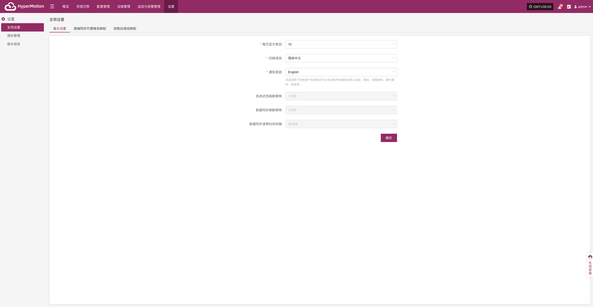
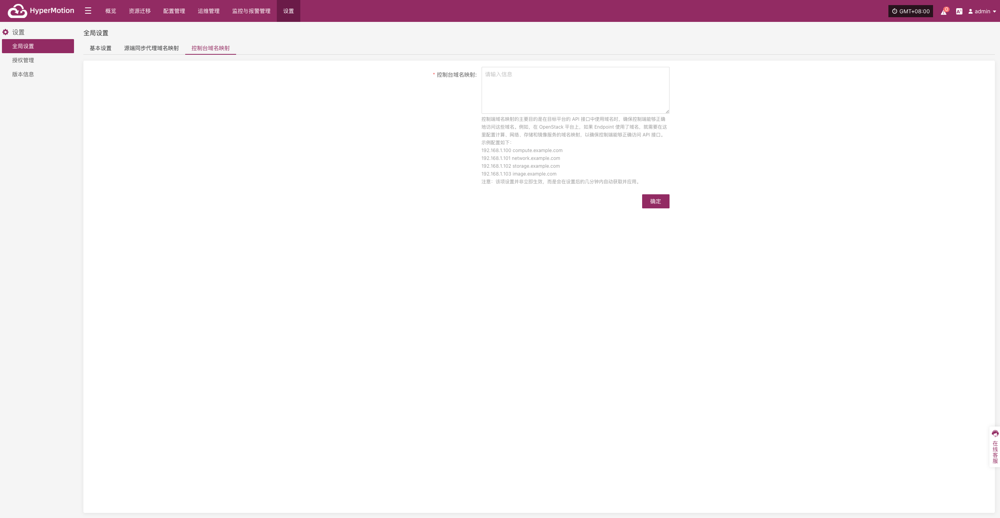

# **全局设置**

## **基本设置**

可以根据需求，进行平台侧的相关配置，包含展示数据条目、语言、等配置。

- 参数配置说明

|       **参数**       |         **可选配置**         |                             **说明**                             |
| :------------------: | :--------------------------: | :--------------------------------------------------------------: |
|     每页显示条目     | 10 / 20 / 30 / 40 / 50 / 60  |         设置平台表格展示页面的每页显示条目，默认为 10。          |
|       切换语言       | 简体中文 / English / Español | 平台默认展示语言，仅作用于当前用户，全局生效，但不影响其他用户。 |
|       通知语言       |      简体中文 / English      |   设置系统发送告警的语言类型（适用于邮件、短信、Webhook 等）。   |
|   系统状态刷新频率   |            1 分钟            |                默认 1 分钟，当前版本不支持修改。                 |
|   数据同步刷新频率   |            1 分钟            |                默认 1 分钟，当前版本不支持修改。                 |
| 数据同步速率时间间隔 |             N/A              |                          默认不可修改。                          |



## **源端同步代理域名设置**

全局设置，点击 “源端同步代理域名设置”，即可添加源端生产平台的域名和 IP 地址对应关闭，格式与 Linux 系统下/etc/hosts 配置格式一致。

- 参数配置说明

源端同步代理的域名映射配置主要用于以下情况：当源端需要连接的 vCenter、ESXi 或云平台 API 接口使用域名配置且未配置 DNS 时，需进行此配置，否则同步代理将无法正常进行数据同步。例如，在 VMware 环境中，如果包含多个 ESXi，则每台主机的 IP 地址和域名映射都需要在此处进行配置。
示例配置如下：

```plain text
192.168.1.10 esxi1.example.com
192.168.1.11 esxi2.example.com
192.168.1.12 esxi3.example.com
```

> 注意：该项设置并非立即生效，而是会在设置后的几分钟内自动获取并应用。


## **控制台域名映射**

全局设置，点击 控制台域名映射，即可添加源端生产平台的域名和 IP 地址对应关闭，格式与 Linux 系统下/etc/hosts 配置格式一致。

- 参数配置说明

控制端域名映射的主要目的是在目标平台的 API 接口中使用域名时，确保控制端能够正确地访问这些域名。例如，在 OpenStack 平台上，如果 Endpoint 使用了域名，就需要在这里配置计算、网络、存储和镜像服务的域名映射，以确保控制端能够正确访问 API 接口。
示例配置如下：

```plaintext
192.168.1.100 compute.example.com
192.168.1.101 network.example.com
192.168.1.102 storage.example.com
192.168.1.103 image.example.com
```

> 注意：该项设置并非立即生效，而是会在设置后的几分钟内自动获取并应用。


