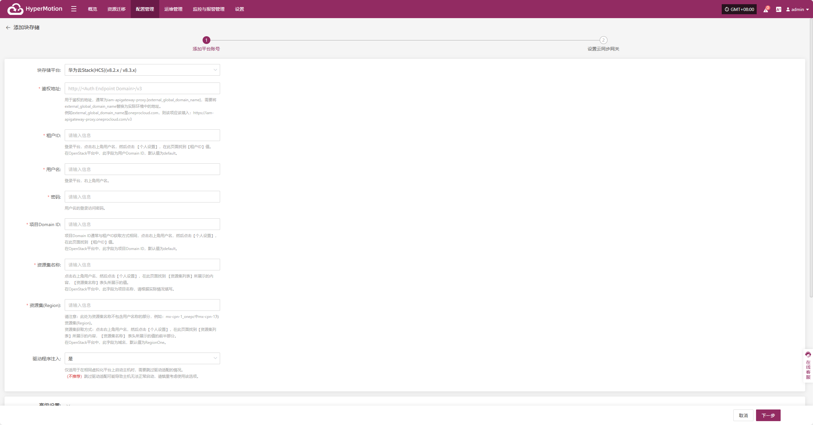
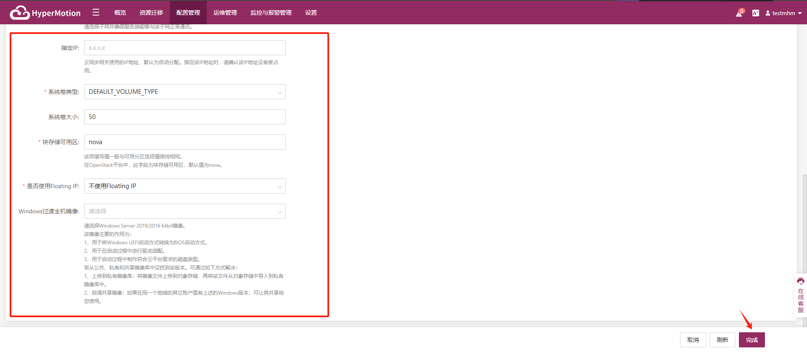

# **华为云Stack(HCS)(v8.2.x/v8.3.x)**

## **添加块存储**

通过顶部导航栏依次选择 **“配置管理” → “存储配置” → “块存储”** 进入块存储页面，点击右上角 “添加” 按钮，可进行块存储的新增配置操作。

### **鉴权信息**

块存储平台通过下拉列表选择“华为云Stack(HCS)(v8.2.x/v8.3.x)”，根据接入块存储的实际情况，填写以下平台鉴权信息：

> 若您不确定相关信息如何获取，可点击下方“点击查看”了解详细操作说明。 
> [👉 点击查看](../../../userguide/faq/faq.md#how-to-obtain-huawei-cloud-hcs-8-x-platform-credentials-information)

* 鉴权信息说明

| **配置项**     | **示例值**                                         | **说明**                                                                                                                                           | **备注(类比OpenStack平台的相关字段举例说明)**         |
| ------------- | ------------------------------------------------- | ------------------------------------------------------------------------------------------------------------------------------------------------ | ----------------------------------------------------------- |
| 块存储平台       | 华为云Stack(HCS)(v8.2.x/v8.3.x)                    | 通过下拉列表选择“华为云Stack(HCS)(v8.2.x/v8.3.x)”。                                                                                                          | --                                                          |
| 鉴权地址        | https://iam-apigateway-proxy.oneprocloud.com/v3 | 用于鉴权的地址，格式通常为 `https://iam-apigateway-proxy.{external_global_domain_name}/v3`。 请将 `{external_global_domain_name}` 替换为实际环境域名，例如 `oneprocloud.com`。 | --                                                          |
| 租户ID        | HPUAAG0B2•••••••••••••••                        | 登录平台后，点击右上角用户名 → 【个人设置】，在该页面找到【租户ID】。                                                                                                            | 在OpenStack平台中，此字段为用户Domain ID，默认值为default。 |
| 用户名         | zhangweizhen                                    | 登录平台的用户名。                                                                                                                                        | --                                                          |
| 密码          | 125••••••••                                     | 用户名对应的登录密码。                                                                                                                                      | --                                                          |
| 项目Domain ID | default                                         | 通常为 `default`。如需获取，请点击右上角用户名 → 【个人设置】，查看【租户ID】字段。                                                                                                | 在OpenStack平台中，此字段为项目Domain ID，默认值为default。 |
| 资源集名称       | zhangweizhen                                    | 点击右上角用户名 → 【个人设置】，查看【资源集列表】中的【资源集名称】列所示值。                                                                                                        | 在OpenStack平台中，此字段为项目名称，请根据实际情况填写。          |
| 资源集(Region) | RegionOne                                       | 请填写【资源集名称】中不含用户名部分的前缀。例如 `mx-cpn-1_onepc` 中的 `mx-cpn-1`。                                                                                         | 在OpenStack平台中，此字段为域名，默认值为RegionOne。        |
| 驱动程序注入      | 是 / 否                                           | 仅适用于在相同虚拟化平台上启动主机时，需要跳过驱动适配的情况。（不推荐）跳过驱动适配可能导致主机无法正常启动，请慎重考虑使用该选项。                                                                               | --                                                          |

* 高级设置说明

| **配置项**            | **示例值**                                        | **说明**                                            |
| ------------------ | ---------------------------------------------- | ------------------------------------------------- |
| 云同步网关镜像 SSH 通讯端口   | 22                                             | 该项是登录云同步网关镜像时的 SSH 通讯端口，默认留空时为SSH端口为`22`          |
| 云同步网关镜像 SSH root密码 | 请输入信息                                          | 该项是登录云同步网关镜像时的 SSH root 密码，默认留空时密码为`Acb@132.Inst` |
| 过渡主机镜像用户名          | 请输入信息                                          | 过渡主机镜像用户名，默认留空是用户名为`root`                         |
| 过渡主机镜像密码           | 请输入信息                                          | 该项是过渡主机镜像启动时的密码，默认留空时密码为`Acb@132.Inst`            |
| 过渡主机镜像通讯端口         | 10729                                          | 过渡主机镜像通讯端口，默认留空时通讯端口为`10729`                      |
| 驱动适配网络方式           | 公网网络不使用代理 | 该选项是驱动适配主机的网络连接方式                                 |

鉴权信息填写完毕后，点&#x51FB;**"下一步"**&#x5F00;始进&#x884C;**"设置云同步网关"**

### **设置云同步网关**

为云同步网关配置区域，子网等，确保其在目标环境中稳定高效运行。

* 设置云同步网关说明

| **配置项**         | **示例值**                                                 | **说明**                                                                                                                                                                                                                     |
| --------------- | ------------------------------------------------------- | -------------------------------------------------------------------------------------------------------------------------------------------------------------------------------------------------------------------------- |
| 项目              | kl-\*\*\*\*\*\*\*\*\*\*\*                               |                                                                                                                                                                                                                            |
| 地域              | kl-\*\*\*\*\*\*\*\*\*\*\*                               | 请选择云同步网关安装的地域                                                                                                                                                                                                              |
| 可用分区            | az-\*\*\*\*\*\*\*\*\*\*                                 | 可通过下拉列表选择对应区域内的可用区，在OpenStack平台中，此字段为计算可用区，默认值为nova.                                                                                                                                                                       |
| 镜像              | Ubuntu-20.04                                            | 创建云同步网关时，应选择列表中Lnux操作系统。如果列表中没有镜像，请手动上传一个Ubuntu 20.04版本的镜像。注:为了防止镜像命名不规范，此处列出了所有镜像信息，请务必选择要求的作系统镜                                                                                                                          |
| 规格              | 2u-8g(2C8G)                                             | 选择合适云同步网关规格                                                                                                                                                                                                                |
| 网络              | project-vpc (xxx.xxx.xxx.xxx/xx)                        | 通过下拉列表选择云同步网关所属的私有网络，仅显示同地区的网络配置，具体以实际为准                                                                                                                                                                                   |
| 子网              | project-subnet-public1-cn-north-1a (xxx.xxx.xxx.xxx/xx) | 请选择子网并确保服务端能够与该子网正常通讯，具体以实际为准                                                                                                                                                                                              |
| 指定IP            | x.x.x.x                                                 | 云同步网关使用的IP地址，默认为自动分配。指定该IP地址时，请确认该IP地址没有被占用。                                                                                                                                                                               |
| 系统卷类型           | DEFAULT VOLUME TYPE\_DEFAULT\_                          | 具体以实际为准                                                                                                                                                                                                                    |
| 系统卷大小           | 50                                                      | 根据同步网关工作负载选择合适大小，默认为50G，建议大小50G                                                                                                                                                                                            |
| 块存储可用区          | nova                                                    | 该项填写值一般与可用分区选项值保持相同，在OpenStack中默认值为nova。                                                                                                                                                                                   |
| 是否使用Floating IP | 不使用Floating IP                                          | 根据实际情况是否选择启动，选择自动创建时会调用接口在选择的忘了区域内自动创建对应Floating IP，选择手动创建时根据下拉列表选择对应已创建的Floating IP地址即可                                                                                                                                   |
| Windows过渡主机镜像   | Windows Server 2019-XXXXXXXXXX                          | 该镜像主要的作用为：1. 用于将 Windows UEFI 启动方式转换为 BIOS 启动方式。2. 用于在启动过程中进行驱动适配。3. 用于启动过程中制作符合云平台需求的磁盘类型。若从公共、私有和共享镜像库中没找到该版本，可通过如下方式解决：1. 上传到私有镜像库：将镜像文件上传到对象存储，再将该文件从对象存储中导入到私有镜像库中。2. 获得共享镜像：如果在同一个地域的其它账户里有上述的 Windows 版本，可让其共享给您使用。 |

云同步网关设置完成后，点&#x51FB;**“完成”**，系统将开始自动创建云同步网关及过渡主机镜像

<!-- @include: ./huawei.md#snippet -->