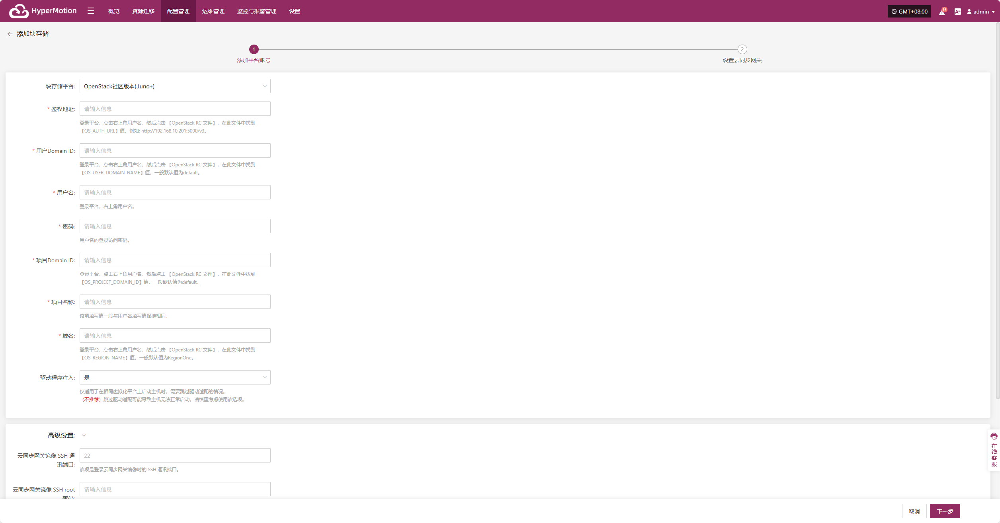
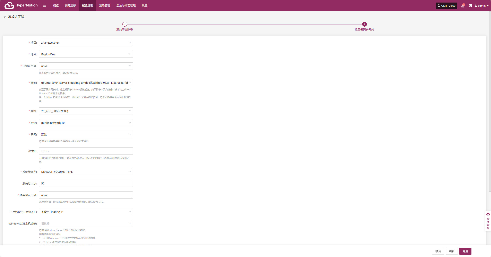

# **OpenStack社区版本(Juno+)**

## **添加块存储**

通过顶部导航栏依次选择 **“配置管理” → “存储配置” → “块存储”** 进入块存储页面，点击右上角 “添加” 按钮，可进行块存储的新增配置操作。

### **添加平台账号**

块存储平台通过下拉列表选择“OpenStack社区版本(Juno+)”，根据接入块存储的实际情况，填写以下平台鉴权信息：

> 若您不确定相关信息如何获取，可点击下方“点击查看”了解详细操作说明。 
> [👉 点击查看](https://qa.oneprocloud.com/questions/D1n6)

* 添加平台账号说明

| **配置项**     | **示例值**                       | **说明**                                                                                          |
| ----------- | ----------------------------- | ----------------------------------------------------------------------------------------------- |
| 块存储平台       | OpenStack社区版本(Juno+)          | 通过下拉列表找到并选择OpenStack社区版本(Juno+)                                                                                 |
| 鉴权地址        | http://192.168.10.201:5000/v3 | 登录平台，点击右上角用户名，然后点击 【OpenStack RC 文件】，在此文件中找到【OS\_AUTH\_URL】值，例如: http://192.168.10.201:5000/v3。 |
| 用户Domain ID | default                       | 登录平台，点击右上角用户名，然后点击 【OpenStack RC 文件】，在此文件中找到【OS\_USER\_DOMAIN\_NAME】值，一般默认值为default。            |
| 用户名         | zhangweizhen                  | 登录平台，右上角用户名。                                                                                    |
| 密码          | \*\*\*\*\*\*\*\*\*\*\*\*      | 用户名的登录访问密码。                                                                                     |
| 项目Domain ID | default                       | 登录平台，点击右上角用户名，然后点击 【OpenStack RC 文件】，在此文件中找到【OS\_PROJECT\_DOMAIN\_ID】值，一般默认值为default。           |
| 项目名称        | zhangweizhen                  | 该项填写值一般与用户名填写值保持相同。                                                                             |
| 域名          | RegionOne                     | 登录平台，点击右上角用户名，然后点击 【OpenStack RC 文件】，在此文件中找到【OS\_REGION\_NAME】值，一般默认值为RegionOne。                |
| 驱动程序注入      | 是 / 否                         | 仅适用于在相同虚拟化平台上启动主机时，需要跳过驱动适配的情况。&#xA;（不推荐）跳过驱动适配可能导致主机无法正常启动，请慎重考虑使用该选项。                         |

* 高级设置说明

| **配置项**            | **示例值**                                        | **说明**                                            |
| ------------------ | ---------------------------------------------- | ------------------------------------------------- |
| 云同步网关镜像 SSH 通讯端口   | 22                                             | 该项是登录云同步网关镜像时的 SSH 通讯端口，默认留空时为SSH端口为`22`          |
| 云同步网关镜像 SSH root密码 | 请输入信息                                          | 该项是登录云同步网关镜像时的 SSH root 密码，默认留空时密码为`Acb@132.Inst` |
| 过渡主机镜像用户名          | 请输入信息                                          | 过渡主机镜像用户名，默认留空是用户名为`root`                         |
| 过渡主机镜像密码           | 请输入信息                                          | 该项是过渡主机镜像启动时的密码，默认留空时密码为`Acb@132.Inst`            |
| 过渡主机镜像通讯端口         | 10729                                          | 过渡主机镜像通讯端口，默认留空时通讯端口为`10729`                      |
| 驱动适配网络方式           | 公网网络不使用代理内网网络不使用代理公网网络并通过云同步网关代理内网网络并通过云同步网关代理 | 该选项是驱动适配主机的网络连接方式                                 |

鉴权信息填写完毕后，点击 **"下一步"** 开始进行 **"设置云同步网关"**

### **设置云同步网关**

为云同步网关配置区域，子网等，确保其在目标环境中稳定高效运行。

* 设置云同步网关说明

| **配置项**         | **示例值**                                                 | **说明**                                                                                                                                                                                                                                        |
| --------------- | ------------------------------------------------------- | --------------------------------------------------------------------------------------------------------------------------------------------------------------------------------------------------------------------------------------------- |
| 项目              | zhangweizhen                                            |                                                                                                                                                                                                                                               |
| 地域              | RegionOne                                               |                                                                                                                                                                                                                                               |
| 计算可用区           | nova                                                    | 此字段为计算可用区，默认值为nova。具体以实际为准                                                                                                                                                                                                                    |
| 镜像              | ubuntu-20.04-XXXXXXXXXXXXX                              | 创建云同步网关时，应选择列表中Linux操作系统。如果列表中没有镜像，请手动上传一个Ubuntu 20.04版本的镜像。&#xA;注：为了防止镜像命名不规范，此处列出了所有镜像信息，请务必选择要求的操作系统镜像。                                                                                                                                    |
| 规格              | 2C\_4GB 50GB(2C4G)                                      | 云同步网关主要用于数据同步，建议选择至少包含 2 vCPU \| 4 GB 及以上的实例，并确保基准带宽高于1Gbps，以保证云同步网关在接收和管理数据同步时的同步效率和性能稳定                                                                                                                                                     |
| 网络              | project-vpc (xxx.xxx.xxx.xxx/xx)                        | 通过下拉列表选择云同步网关所属的私有网络，仅显示同地区的网络配置，具体以实际为准                                                                                                                                                                                                      |
| 子网              | project-subnet-public1-cn-north-1a (xxx.xxx.xxx.xxx/xx) | 请选择子网并确保服务端能够与该子网正常通讯，具体以实际为准                                                                                                                                                                                                                 |
| 指定IP            | x.x.x.x                                                 | 云同步网关使用的IP地址，默认为自动分配。指定该IP地址时，请确认该IP地址没有被占用。                                                                                                                                                                                                  |
| 系统卷类型           | DEFAULT VOLUME TYPE\_DEFAULT\_                          | 具体以实际为准                                                                                                                                                                                                                                       |
| 系统卷大小           | 50                                                      | 根据同步网关工作负载选择合适大小，默认为50G，建议大小50G                                                                                                                                                                                                               |
| 块存储可用区          | nova                                                    | 该项填写值一般与计算可用区选项值保持相同，默认值为nova。                                                                                                                                                                                                                |
| 是否使用Floating IP | 不使用Floating IP自动创建Floating IP手动选择FloatingIP             | 根据实际情况是否选择启动，选择自动创建时会调用接口在选择的忘了区域内自动创建对应Floating IP，选择手动创建时根据下拉列表选择对应已创建的Floating IP地址即可                                                                                                                                                      |
| Windows过渡主机镜像   | WINSRV\_2019\_xxxxxxxx                                  | 该镜像主要的作用为：&#xA;1、用于将Windows UEFI启动方式转换为BIOS启动方式。&#xA;2、用于在启动过程中进行驱动适配。&#xA;3、用于启动过程中制作符合云平台需求的磁盘类型。&#xA;若从公共、私有和共享镜像库中没找到该版本。可通过如下方式解决：&#xA;1、上传到私有镜像库：将镜像文件上传到对象存储，再将该文件从对象存储中导入到私有镜像库中。&#xA;2、获得共享镜像：如果在同一个地域的其它账户里有上述的Windows版本，可让其共享给您使用。 |
| 引导类型            | 卷启动 / 镜像启动                                              | 推荐使用卷启动方式缩短启动时间，但是由于平台限制无法使用卷启动时，可以使用镜像启动方式。                                                                                                                                                                                                  |

* 网络高级设置说明

| **配置项**   | **示例值**         | **说明**                                                       |
| --------- | --------------- | ------------------------------------------------------------ |
| 云同步网关控制网络 | 内网 / 公网         | 设置控制台与云同步网关之间的控制指令下发网络，例如：在使用 VPN 或者专线时，应当选择内网。              |
| 自定义控制网络   | 请输入IPv4/IPv6/域名 | 默认情况下无需配置。只有在按需连接时（例如：进行NAT地址转换时）才需要进行配置。支持输入IPv4、IPv6地址和域名。 |
| 数据传输网络    | 内网 / 公网         | 设置源端与云同步网关之间进行数据传输的网络，例如：在使用 VPN 或者专线时，应当选择内网。               |
| 自定义数据传输网络 | 请输入IPv4/IPv6/域名 | 默认情况下无需配置。只有在按需连接时（例如：进行NAT地址转换时）才需要进行配置。支持输入IPv4、IPv6地址和域名。 |

* 数据传输高级设置说明

| **配置项** | **可选值**                   | **说明**                                                                                 |
| ------- | ------------------------- | -------------------------------------------------------------------------------------- |
| 数据传输协议  | S3Block / iSCSI(即将退役，不推荐) | 该选项是源端与同步网关之间的数据传输协议。&#xA;S3Block 在广域网中应用广泛，更加适合数据传输。&#xA;iSCSI 协议用于存储网络，适用于网络环境稳定的场景。 |

设置云同步网关完成后，点击**“完成”**，系统将开始自动创建云同步网关及过渡主机镜像

<!-- @include: ./huawei.md#snippet -->