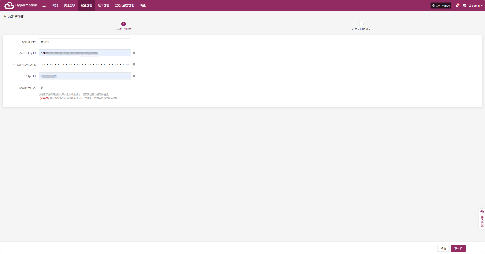
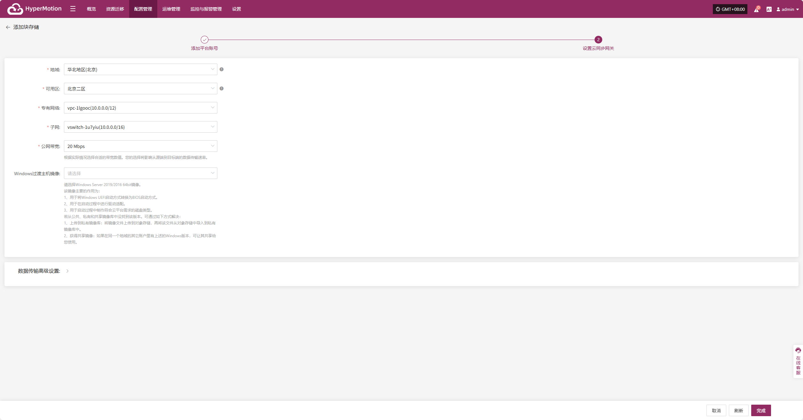

# **腾讯云**

## **添加块存储**

通过顶部导航栏依次选择 **“配置管理” → “存储配置” → “块存储”** 进入块存储页面，点击右上角 “添加” 按钮，可进行块存储的新增配置操作。

### **添加平台账号**

块存储平台通过下拉列表选择“腾讯云”，根据接入块存储的实际情况，填写以下平台鉴权信息：

* **添加平台账号说明**

| **配置项**           | **示例值**                          | **说明**                                                                  |
| ----------------- | -------------------------------- | ----------------------------------------------------------------------- |
| 块存储平台             | 腾讯云                              | 通过下拉列表找到并选择腾讯云                                                          |
| Access Key ID     | HPUAAG0B2•••••••••••••••         | 访问腾讯云 API 的密钥，具有该账户完全的权限，登录管理控制台→右上角个人信息→【访问管理】→【API密钥管理】               |
| Access Key Secret | •••••••••••••••••••••••••••••••• | 访问腾讯云 API 的密钥，具有该账户完全的权限，登录管理控制台→右上角个人信息→【访问管理】→【API密钥管理】               |
| App ID            | 125••••••••                      | 腾讯云API请求的重要凭证，登录管理控制台一右上角个人信息一【账号信息】→【基本信息】→【APP ID】                    |
| 驱动程序注入            | 是 / 否                            | 仅适用于在相同虚拟化平台上启动主机时，需要跳过驱动适配的情况。&#xA;（不推荐）跳过驱动适配可能导致主机无法正常启动，请慎重考虑使用该选项。 |

鉴权信息填写完毕后，点&#x51FB;**"下一步"**&#x5F00;始进&#x884C;**"设置云同步网关"**

### **设置云同步网关**

为云同步网关区域，子网等，确保其在目标环境中稳定高效运行。

* **设置云同步网关说明**

| **配置项**             | **示例值**                                         | **说明**                                                                                                                                                                                                                                                                                                                                                                         |
|----------------------|--------------------------------------------------|----------------------------------------------------------------------------------------------------------------------------------------------------------------------------------------------------------------------------------------------------------------------------------------------------------------------------------------------------------------------------------|
| 地域                  | 华北地区（北京）                                     | 请选择云同步网关安装的地域                                                                                                                                                                                                                                                                                                                                                               |
| 可用区                | 北京二区                                            | 可通过下拉列表选择对应区域内的可用区                                                                                                                                                                                                                                                                                                                                                       |
| 专有网络              | vpc-1lgooc (10.0.0.0/12)                         | 通过下拉列表选择云同步网关所属的私有网络，具体以实际为准                                                                                                                                                                                                                                                                                                                                         |
| 子网                  | vswitch-1u7yiu (10.0.0.0/16)                     | 通过下拉列表选择所属可用区中的子网，具体以实际为准                                                                                                                                                                                                                                                                                                                                          |
| 公网带宽              | 20 Mbps                                          | 根据实际情况选择合适的带宽数值。 您的选择将影响从源端到目标端的数据传输速率。                                                                                                                                                                                                                                                                                                              |
| Windows过渡主机镜像   | Windows Server 2019 数据中心版 64位 中文版（推荐） | 该镜像主要的作用为： 1. 用于将 Windows UEFI 启动方式转换为 BIOS 启动方式； 2. 用于在启动过程中进行驱动适配； 3. 用于启动过程中制作符合云平台需求的磁盘类型。  若从公共、私有和共享镜像库中未找到该版本，可通过如下方式解决： - 上传到私有镜像库：将镜像文件上传到对象存储，再将该文件从对象存储中导入到私有镜像库中； - 获得共享镜像：如果在同一地域的其他账户中已有该 Windows 版本镜像，可请求其共享给您使用。 |

* **数据传输高级设置**

| **配置项**     | **可选值**                       | **说明**                                                                                                                                             |
|----------------|----------------------------------|------------------------------------------------------------------------------------------------------------------------------------------------------|
| 数据传输协议   | S3Block / iSCSI（即将退役，不推荐） | 该选项是源端与同步网关之间的数据传输协议。 S3Block 在广域网中应用广泛，更加适合数据传输。 iSCSI 协议用于存储网络，适用于网络环境稳定的场景。 |

云同步网关设置完成后，点&#x51FB;**“完成”**，系统将开始自动创建云同步网关及过渡主机镜像

<!-- @include: ./huawei.md#snippet -->