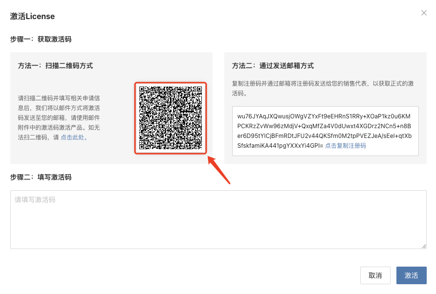

# HyperBDR配置

[[toc]]

## 申请HyperBDR授权

::: tip
默认已登录到HyperBDR控制台。
:::

### 激活授权

转到[设置]->[授权管理]，然后点击[+添加]按钮： 

激活许可证有两种方法： 

#### I. 通过使用二维码激活授权

  

扫描QR码并填写申请表。OnePro Cloud客户服务在审核申请后将通过电子邮件发送激活码给用户。 

填写激活码并点击[激活]按钮。 

::: warning
请确保申请表上提供的电子邮件地址是正确的，否则将无法收到激活码。  
:::

#### II. 通过使用注册码激活授权

 

复制并将注册码发送给OnePro Cloud，客户服务将通过电子邮件发送激活码给用户。 

填写激活码并点击[激活]按钮。

::: tip
用户可以将注册码发送给OnePro Cloud销售代表或者 [enquiry@oneprocloud.com](mailto:enquiry@oneprocloud.com)邮箱来申请授权.
:::

## 在HyperBDR中验证代理注册

::: tip
代理节点安装完成后，它将自动添加到HyperBDR，并且您可以在HyperBDR中查看此代理节点机器。
:::

::: tip
默认已登录到HyperBDR控制台。
:::

### 检查代理节点的状态  

点击顶部菜单栏的 '配置管理'、'生产站点配置'、'同步节点' 来查看代理节点主机。如果您能看到这个主机，并且状态为 '正常'，则表示它已成功注册到HyperBDR，您可以继续进行进一步的配置和使用。

## 添加VMware链接

::: tip
使用预先准备好的VMware账户信息，将VMware添加到HyperBDR平台作为灾难恢复源端生产平台。
:::

::: tip
默认已登录到HyperBDR控制台。
:::

### 添加VMware到 HyperBDR

点击顶部菜单栏的 '配置管理'、'生产站点配置'、'VMware'。点击 '+添加' 按钮，然后在弹出的页面上点击 '下一步' 按钮。按照提示填写VMware信息，然后点击 'Submit' 按钮。

| 鉴权地址 | https://\<vCenter IP/Domain Name\>:443 |
| --- | --- |
| 用户名 | \<vCenter\>用户名 |
| 密码 | \<vCenter\>密码 |
| 同步节点 | \<同步节点 IP\> |

## 在HyperBDR中验证VMware的状态

::: tip
默认已登录到HyperBDR控制台
:::

### 检查VMware连接的状态

点击顶部菜单栏 '配置管理'、'生产站点配置'、'VMware'，查看添加的源端VMware账户的状态，以及获取诸如主机数量之类的信息。您还可以点击VMware的名称来查看详细信息和主机详情。如果一切正常，可以继续进行后续的配置操作。

如果状态为 '正常'，表示添加成功。

## 添加对象存储

::: tip
默认已登录到HyperBDR控制台。  
:::

### 配置步骤

::: tip
使用提供的IAM账号的AK/SK信息，在HyperBDR控制台中配置并添加华为云对象存储桶。
:::

- 步骤1: 点击顶部菜单栏 '配置管理'、'对象存储'。点击 '+添加' 按钮。  

- 步骤2: 根据提示填写或选择相应的参数，点击 '确定'，然后等待完成。  

## 添加DR恢复网关

::: tip
默认已登录到HyperBDR控制台。
:::

### 配置步骤

::: tip
使用提供的IAM账号的AK/SK信息，在HyperBDR控制台中配置并添加华为云恢复网关
:::

点击顶部菜单栏 "配置管理"， "对象存储恢复网关"，点击 "+添加" 按钮，根据提示填写或选择相应的参数，点击 "确定"，然后等待完成。

::: tip
Windows UEFI 修复镜像使用您上传的私有 Windows 镜像。

文档链接: [https://docs.oneprocloud.com/userguide/poc/huaweicloud-pre-settings.html#image-download-upload](https://docs.oneprocloud.com/userguide/poc/huaweicloud-pre-settings.html#image-download-upload)
:::

## 在HyperBDR中添加VMware主机

::: tip
默认已登录到HyperBDR控制台。  
默认已在HyperBDR中添加了VMware连接。
:::

### 配置步骤

点击顶部菜单栏 "资源容灾"，"主机容灾"，点击 "添加主机" 按钮，选择 "无代理模式" "VMware" ，选择之前添加的VMware账户，过滤并选择所需的灾难恢复主机，最后点击确认。一旦选择完成，点击确认将VMware灾难恢复主机添加到灾难恢复平台。  

## 绑定/解绑源端同步代理到 VMware 生产站点

::: tip
Agentless 模式下每个源端同步代理默认支持最多 50 块磁盘同时同步，当需要同步的源VMware虚拟机磁盘总数大于50块时，需要扩容 Agentless 源端同步代理。
:::

### 配置步骤
::: tip
默认已登录到HyperBDR控制台。  
默认已在HyperBDR中添加了VMware连接。
:::

1. 点击顶部菜单栏 **配置管理** > **生产站点配置** > **源端同步代理**。
> 已安装的源端同步代理将显示在此页面。

2. 选择已安装的同步代理，点击 **更多操作** > **绑定**。

3. 选择所需的源端链接将新的源端同步代理绑定到生产 VMware 站点，确认后单击 **确定**。

4. 查看与生产 VMware 站点绑定的源端同步代理。

5. 解绑源端同步节点。
::: tip
只能对没有注册主机的源端同步节点进行解绑操作。
:::

